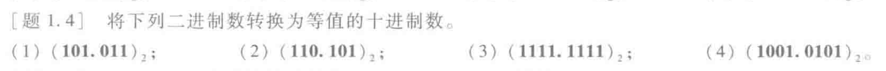

根据二进制转化为十进制的公式

$$D = \sum K_i\times 2^i$$

故：

$$1\times2^{2}+1\times2^{1}+0\times2^{0}+0.1\times2^{-1}+0\times2^{-2}+1\times2^{-3}=6.175$$

---

[题1.7] 将下列十进制数转换为等值的二进制数和十六进制数
$(127)_{10}$

转换成二进制:（整除法）

$$\begin{align*}
\nonumber 127 \div 2 & = 63 \quad \text{(余数 1)} \\
\nonumber 63 \div 2 & = 31 \quad \text{(余数 1)} \\
\nonumber 31 \div 2 & = 15 \quad \text{(余数 1)} \\
\nonumber 15 \div 2 & = 7 \quad \text{(余数 1)} \\
\nonumber 7 \div 2 & = 3 \quad \text{(余数 1)} \\
\nonumber 3 \div 2 & = 1 \quad \text{(余数 1)} \\
\nonumber 1 \div 2 & = 0 \quad \text{(余数 1)} \\
\end{align*}
$$

\[127_{10} = 2^6 + 2^5 + 2^4 + 2^3 + 2^2 + 2^1 + 2^0 = 1111111_2\]

转换成十六进制：
先转化成二进制，再转化成16进制
$$(0111 \  1111)_2 \Rightarrow (7 \ F)_{16} $$
也可以直接转化：

\[ 127_{10} = 7 \times 16^1 + 15 \times 16^0 = (7F)_{16}\]

---

[题 1.9] 将下列十进制数转换为等值的二进制数和十六进制数。要求二进制数保留小数点以后4位有效数字。

$(25.7)_{10}$

让我们将十进制数 \(25.7_{10}\) 转换为二进制数和十六进制数。

1. 转换为二进制数：
   整数部分 \(25_{10}\) 转换为二进制为 \(11001_2\)。
   小数部分 \(0.7_{10}\) 转换为二进制可以通过乘2取整法。下面是计算过程：

   \[
   \begin{align*}
   0.7 \times 2 &= 1.4 \quad (\text{整数部分为} 1) \\
   0.4 \times 2 &= 0.8 \quad (\text{整数部分为} 0) \\
   0.8 \times 2 &= 1.6 \quad (\text{整数部分为} 1) \\
   0.6 \times 2 &= 1.2 \quad (\text{整数部分为} 1) \\
   0.2 \times 2 &= 0.4 \quad (\text{整数部分为} 0) \\
   0.4 \times 2 &= 0.8 \quad (\text{整数部分为} 0) \\
   \end{align*}
   \]

   可以看出，小数部分 \(0.7_{10}\) 的二进制表示为 \(0.\overline{1011}_2\)。

   因此，\(25.7_{10}\) 的二进制表示为 \(11001.1011_2\)。

2. 转换为十六进制数：
   整数部分 \(25_{10}\) 转换为十六进制为 \(19_{16}\)。
   小数部分 \(0.7_{10}\) 的二进制表示已经找到，可以将其转换为十六进制。小数点后的二进制表示 \(0.1011_2\) 转换为十六进制为 \(0.B_{16}\)。

   因此，\(25.7_{10}\) 的十六进制表示为 \(19. B_{16}\)。

所以，\(25.7_{10}\) 转换为二进制数为 \(11001.1011_2\)，转换为十六进制数为 \(19.B_{16}\)。

---

[题1.12] 用8位的二进制补码表示下列十进制数。

+28
-13

二进制：

11100
1101

八位二进制原码：

0 001 1100
1 000 1101

八位二进制反码：

0 001 1100
1 111 0010

八位二进制补码：

0 001 1100
1 111 0011

---

[题1.15] 用二进制补码运算计算下列各式。(提示:所用补码的有效位数应足够表示代数和的最大绝对值)
8+11
12-7
9-12

首先，我们需要确保二进制补码的有效位数足够表示代数和的最大绝对值。在这里，我们假设使用4位二进制补码。

1. 计算 \(8 + 11\)：
   - \(8\) 的二进制补码为 \(1000\)。
   - \(11\) 的二进制补码为 \(1011\)。
   - 将二者相加，得到 \(10011\)，注意舍弃了最高位的进位。由于最高位是符号位，没有溢出。

   所以，\(8 + 11\) 的结果为 \(10011\)。

2. 计算 \(12 - 7\)：
   - \(12\) 的二进制补码为 \(1100\)。
   - \(7\) 的二进制补码为 \(0111\)。
   - 将二者相加，得到 \(10011\)，注意舍弃了最高位的进位。由于最高位是符号位，没有溢出。

   所以，\(12 - 7\) 的结果为 \(10011\)。

3. 计算 \(9 - 12\)：
   - \(9\) 的二进制补码为 \(1001\)。
   - \(12\) 的二进制补码为 \(1100\)。
   - 将二者相加，得到 \(0101\)，注意舍弃了最高位的进位。由于最高位是符号位，没有溢出。

   所以，\(9 - 12\) 的结果为 \(0101\)。

需要注意的是，我们使用的4位二进制补码仅用于演示目的，实际上在计算机中通常会使用更多位的补码来避免溢出。