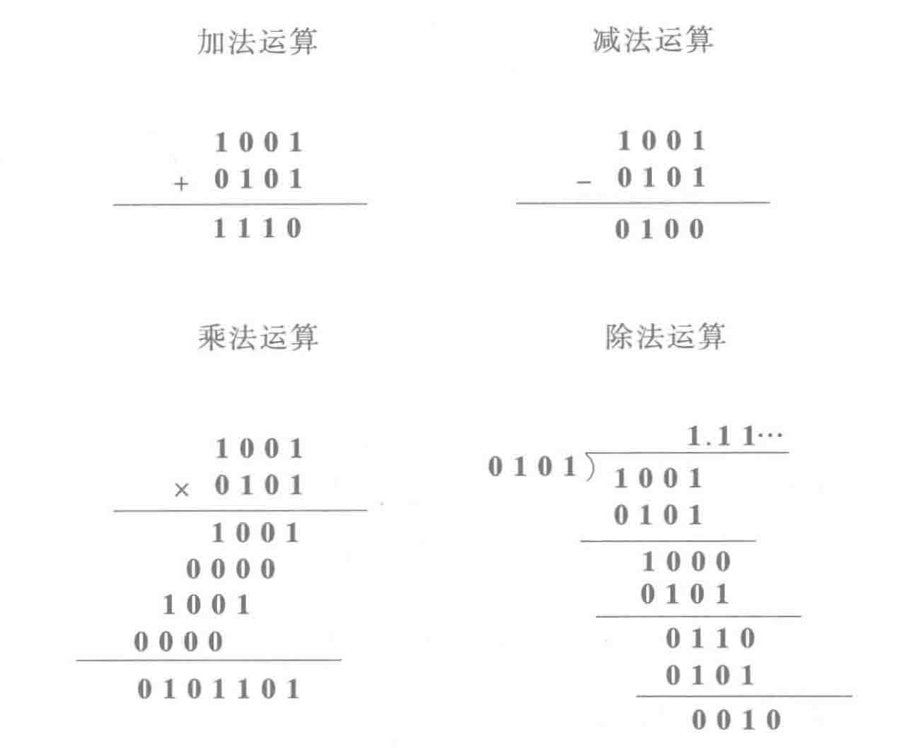

# 二进制运算术

- 运算规则
  - 逢二进一

## 四则运算

- 加法运算（同四则运算）
- 减法运算（补码和反码）

## 反码，补码和补运算

- 原码：最高位为符号位，0为正1为负。例如 0 1000 表示+8 。 1 1000 表示-8。
- 反码：（解决减法问题，但存在+,-0的表示不同）
  - 正数：不变
  - 负数：原码求反
- 补码：（解决反码+,-0的表示不同）
  - 正数：最高位不变，与原码相同。
  - 负数：原码的数值求反，最低位加1。

