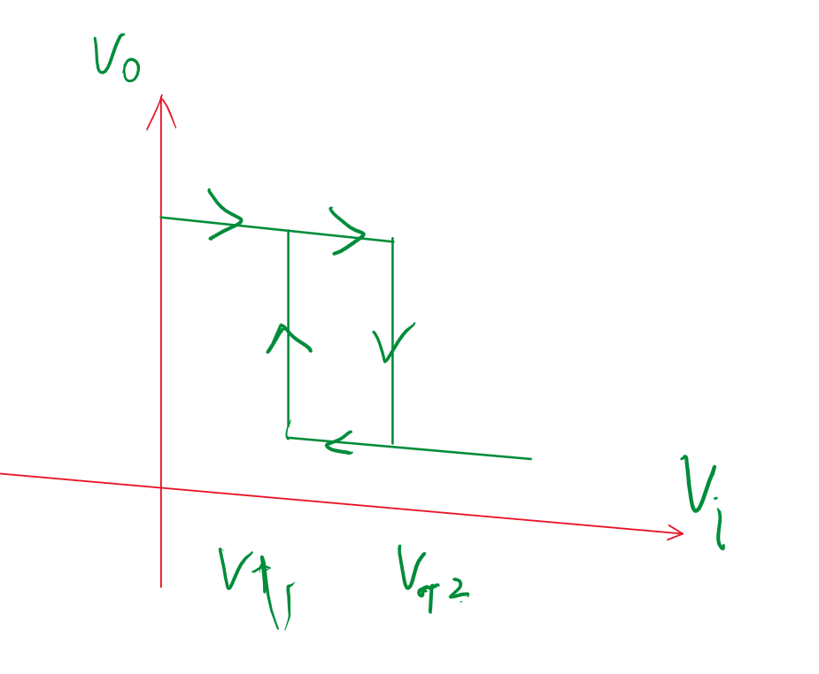
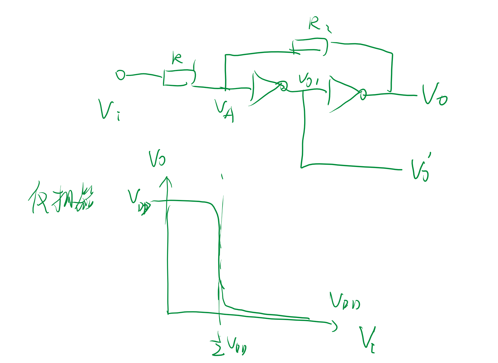
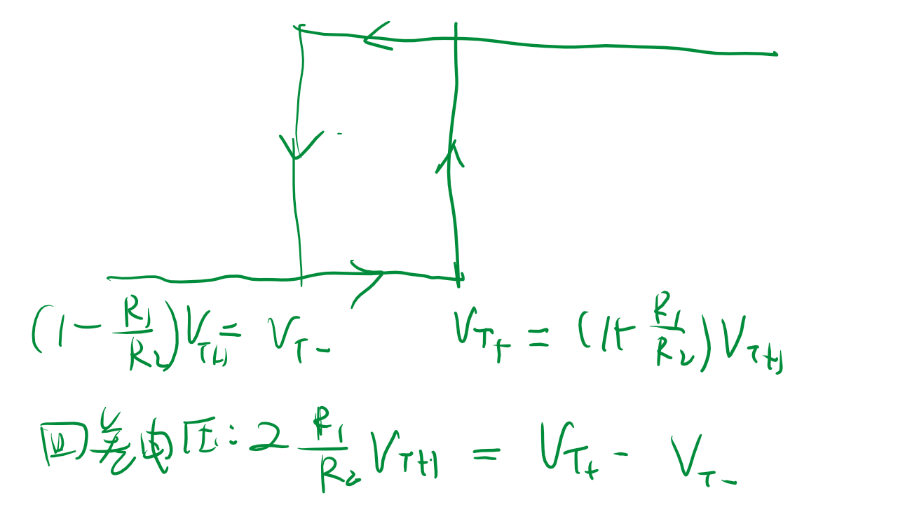
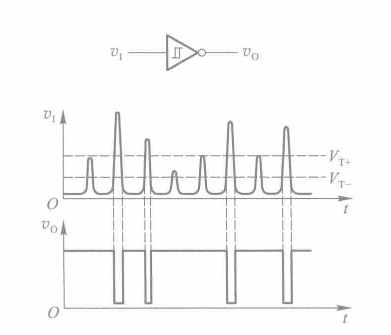
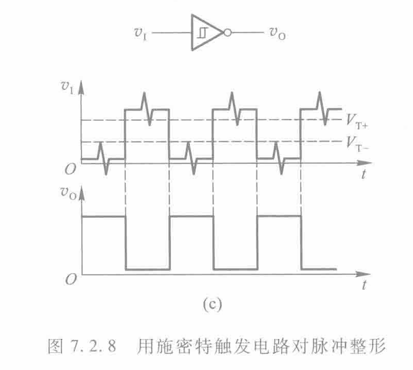
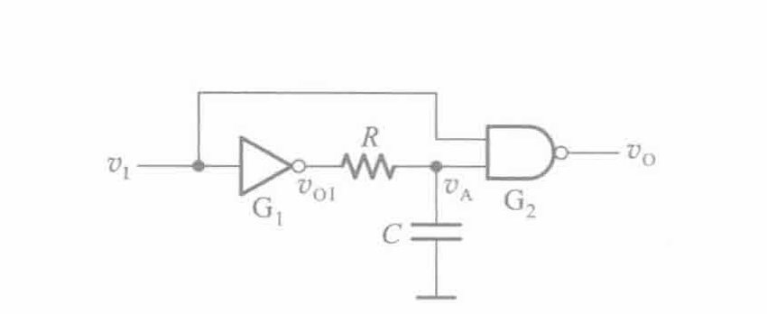
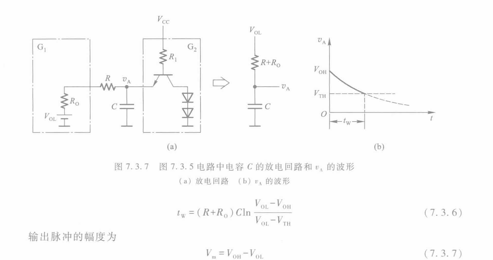

# 脉冲

## 1 脉冲电路

1. 双稳态
2. 施密特
3. 单稳态
4. 多谐振荡器

**基本结构就是电子开关加上惰性系统（储能元件 R,L,C）**

分析需要三要素法

## 2 施密特触发器

施密特触发器不具有记忆功能，**整形电路**，获得矩形脉冲。

反向施密特触发器：

类似于'滞回比较器'`滞回比较器`，有反馈

回差电压

- 应用
  - 噪声检测
  - 波形整形
    
    

## 3 单稳态触发器

