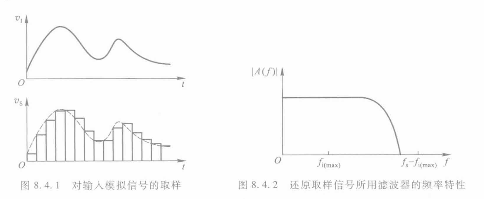
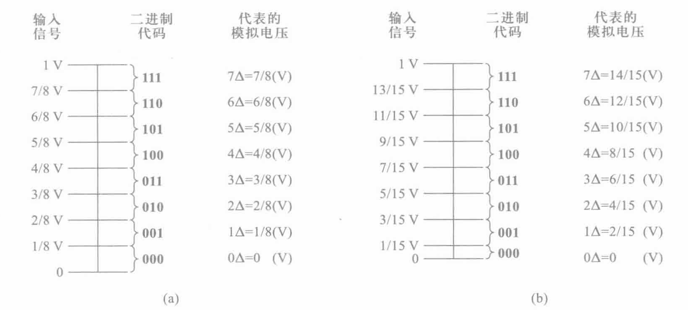
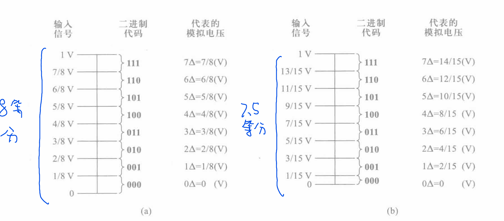
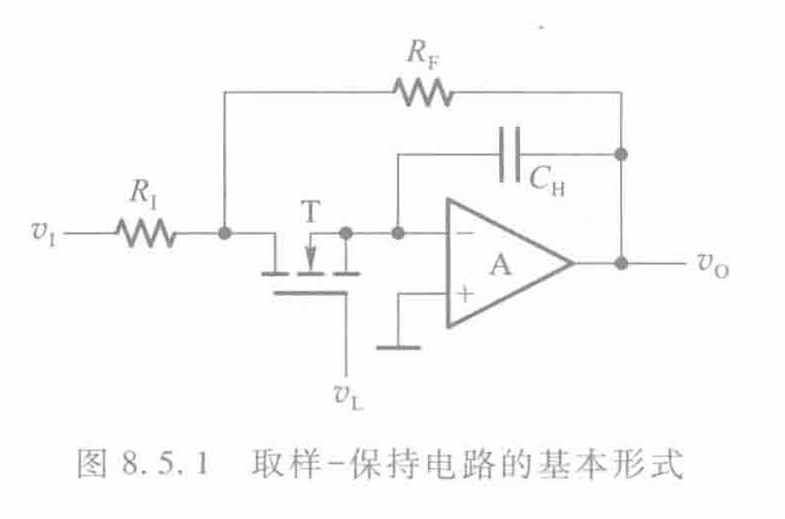
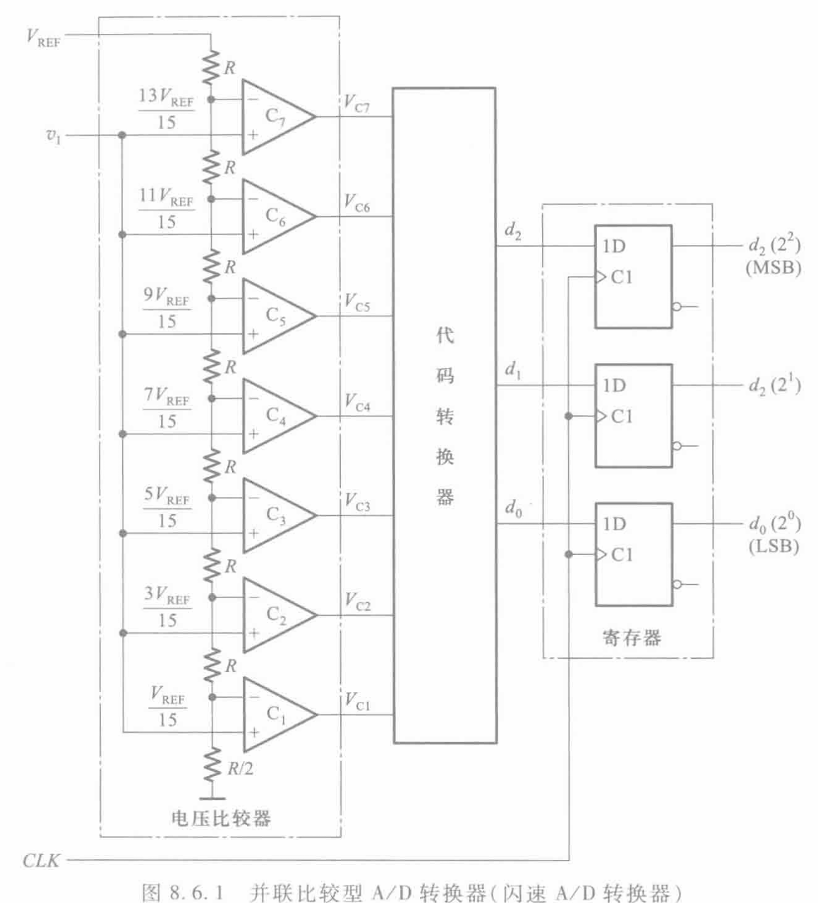

# 数模转化

## 1 D/A 转化器的结构与电路

### 1.1 权电阻网络

### 1.1 倒T型网络

**开关转换，电阻电压不变，电流流向改变**

### 1.2 权电流

## 2 D/A电路的参数

### 2.1 精度/分辨率

1. 用位数表示
2. 用能狗分辨的最小电压值（公式计算）

//core
**给个二进制数求输出电压**

### 2.2 转化误差

### 2.3 零飘

## 2 A/D 转化

### 2.1采样

//采样定理和香农定理，对模拟电压谐波分析，必然是若干正弦波组成，采样频率是最大频率的两倍次啊有意义

$$ f_{s}\geq2f_{i}(max) $$

### 2.2 量化编码

### 2.3 取样保持

速度快，价格高，不易拓展