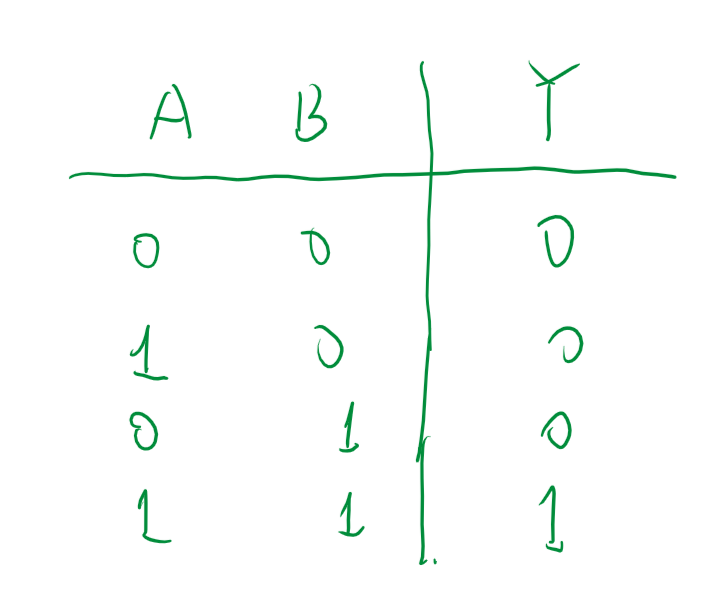

# 概述

<!-- @import "[TOC]" {cmd="toc" depthFrom=1 depthTo=6 orderedList=false} -->

<!-- code_chunk_output -->

- [概述](#概述)
  - [1 概念](#1-概念)
  - [2 基本的逻辑关系](#2-基本的逻辑关系)
  - [2.0 总概](#20-总概)
    - [2.1 与（AND）(AB)](#21-与andab)
    - [2.2 或(OR)(A+B)](#22-或orab)
    - [2.3 非(NOT)(A')](#23-非nota)
    - [2.4 复合逻辑运算](#24-复合逻辑运算)
    - [2.5 公式表](#25-公式表)

<!-- /code_chunk_output -->

## 1 概念

逻辑就是事物的逻辑关系

本书研究二进制算法因此逻辑代数组成的基础就是布尔代数。

二值逻辑：只有两种对立逻辑状态的逻辑关系

香农将逻辑代数引入了电路中，从此开启了数字电路的时代。

- 基本概念
  - 输入变量：条件
  - 输出变量：结果
  - 逻辑函数：输入输出的关系
  - 逻辑电路：实现逻辑函数关系的电路
  - 逻辑运算：逻辑变量之间的状态，是推理运算而非算数运算

## 2 基本的逻辑关系

## 2.0 总概

C语言中
与：&&,或||，非:!

### 2.1 与（AND）(AB)

**与**：当且仅当两个都需要满足True条件时，结果才True。条件需要同时具备，结果才会发生。

你与他来办公室一趟，则两人都需要来事件才成立，这也是英文中AND的含义

符号表示：

### 2.2 或(OR)(A+B)

**或**：条件之一发生，则结果产生

你或她来办公室，则任意一人去则事件成立。

### 2.3 非(NOT)(A')

### 2.4 复合逻辑运算

- 与非（AND-NOT）：$$A\cdot B^{\prime}$$
- 或非（OR-NOT）：$$A^{\prime}+B^{\prime}$$
- 与或非（AND-OR-NOT）：$$A\cdot B+A^{\prime}B^{\prime}$$
- 异或：$$A\oplus B=AB^{\prime}+A^{\prime}B$$
- 同或：$$A\odot B=AB+A^{\prime}B^{\prime}$$

### 2.5 公式表

- **重点：**
  - 分配律：$A + BC = (A+B)(A+C)$
  - 摩根定律（反演律）：$(AB)' = A'+B',(A+B)' = A'B'$ 与关系和或关系的互换。
  - 吸收率：$A + A'B = A + B,AB + A'C + BC = AB + A'C$