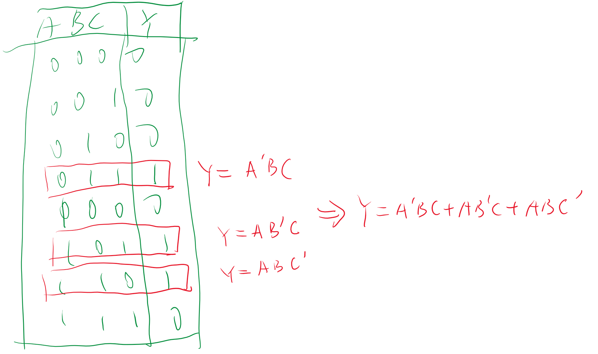

# 逻辑函数及其表示方法

<!-- @import "[TOC]" {cmd="toc" depthFrom=1 depthTo=6 orderedList=false} -->

<!-- code_chunk_output -->

- [逻辑函数及其表示方法](#逻辑函数及其表示方法)
  - [0 逻辑函数的定义](#0-逻辑函数的定义)
  - [1 逻辑函数的表示方法](#1-逻辑函数的表示方法)
    - [1.1 表示方法的转换](#11-表示方法的转换)
      - [1.1.1 真值表与逻辑表达式](#111-真值表与逻辑表达式)
      - [1.1.2 逻辑式到逻辑图](#112-逻辑式到逻辑图)

<!-- /code_chunk_output -->

## 0 逻辑函数的定义

输入变量和输出变量的关系

## 1 逻辑函数的表示方法

1. **真值表**
2. **逻辑表达式**
3. **逻辑图**
4. **卡诺图**
5. 波形图
6. 计算机

### 1.1 表示方法的转换

#### 1.1.1 真值表与逻辑表达式

首先找到输出为1 的数值，写出特殊情况的逻辑关系1用原变量，0用反变量，最终将所有的特殊点进行相加。

逻辑是写真值表只需要进行列举就行，只需要知道真值表具有几行几列

#### 1.1.2 逻辑式到逻辑图

按照输入的顺序直接翻译成逻辑图，注意我们只关心逻辑关系。

