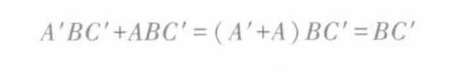
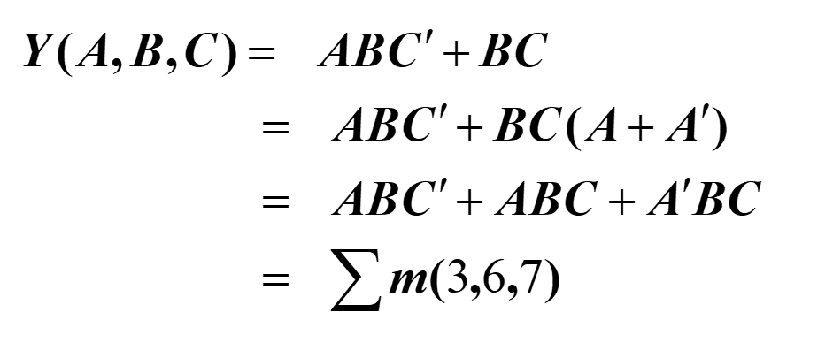
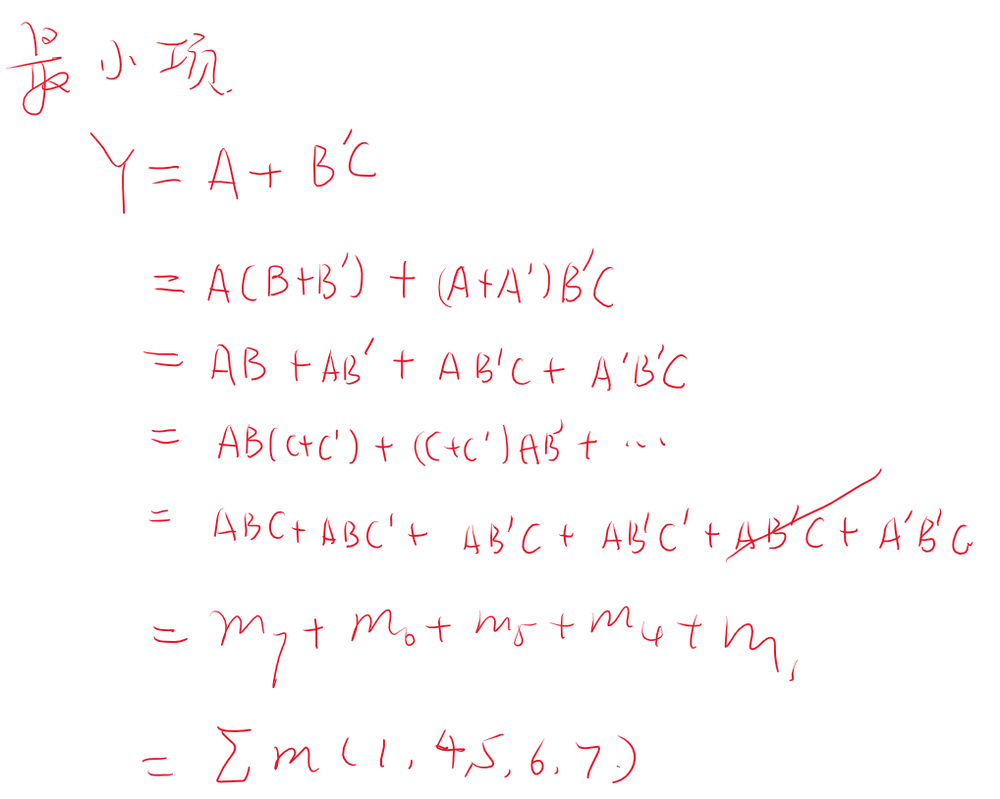

# 逻辑函数及其表示方法

<!-- @import "[TOC]" {cmd="toc" depthFrom=1 depthTo=6 orderedList=false} -->

<!-- code_chunk_output -->

- [逻辑函数及其表示方法](#逻辑函数及其表示方法)
  - [0 逻辑函数的定义](#0-逻辑函数的定义)
  - [1 逻辑函数的表示方法](#1-逻辑函数的表示方法)
    - [1.1 表示方法的转换](#11-表示方法的转换)
      - [1.1.1 真值表与逻辑表达式](#111-真值表与逻辑表达式)
      - [1.1.2 逻辑式到逻辑图](#112-逻辑式到逻辑图)
      - [1.1.3 逻辑图到逻辑式](#113-逻辑图到逻辑式)
  - [2 逻辑函数的标准表示方法](#2-逻辑函数的标准表示方法)
    - [2.1 最小项之和](#21-最小项之和)
    - [2.2 最大项之积](#22-最大项之积)
    - [2.3 最小项和最大项的关系](#23-最小项和最大项的关系)
    - [2.4 例题](#24-例题)

<!-- /code_chunk_output -->

## 0 逻辑函数的定义

输入变量和输出变量的关系

## 1 逻辑函数的表示方法

1. **真值表**
2. **逻辑表达式**
3. **逻辑图**
4. **卡诺图**
5. 波形图
6. 计算机

### 1.1 表示方法的转换

#### 1.1.1 真值表与逻辑表达式

首先找到输出为1 的数值，写出特殊情况的逻辑关系1用原变量，0用反变量，最终将所有的特殊点进行相加。

逻辑是写真值表只需要进行列举就行，只需要知道真值表具有几行几列

#### 1.1.2 逻辑式到逻辑图

按照输入的顺序直接翻译成逻辑图，注意我们只关心逻辑关系。

#### 1.1.3 逻辑图到逻辑式

将初始的信号经过每一个门的时候写在线上

## 2 逻辑函数的标准表示方法

### 2.1 最小项之和

- **最小项m：** 
  - m是乘积项
  - 包含n个因子
  - n个变量均以原变量和反变量的形式在m中出现一次
  - 项数为$2^n$

比如$Y = f(ABC) = ABC , A'BC , A'B'C,共有2^3个最小项$

==最小项对应的就是真值表==

编号表的顺序按照十进制数大小排列，也是二进制从000开始依次加一。所以表达式也可以表示成

$$y = \sum(m_0,m_4,m_7)$$

- **最小项的性质**
  - 在输入变量任一取值下，有且仅有一个最小项的值为1。
  - 全体最小项之和为1。
  - 任何两个最小项之积为0。
  - 两个响铃的最小项可以合并，消去一对银子，只留下公因子。
    - **逻辑相邻**：只有一个变量不同的最小项

- **化最小项方式**
  - 利用公式： $A + A' = 1 $

例如 $Y(A,B,C) = BC' = BC'(A+A')...$

### 2.2 最大项之积

- **最大项的定义**
  - M是相加项
  - 包含n个因子
  - n个变量均以原变量和反变量的形式在M中出现一次。
  - 对于n变量函数$2^n$个

- **最大项的性质**
  - 在输入变量任一取值下，有且仅有一个最大项的值为0
  - 全体最大项之积为0；
  - 任何两个最大项之和为1；
  - 只有一个变量不同的最大项的乘积等于各相同变量之和

  

- **最大项编号**
  - 

### 2.3 最小项和最大项的关系

- $ m_1^{'} = M_1$
- **关系本质是摩根定律的体现**

**这里和可以使用摩根定律转化为非的积，最终转化为最大项的积。**

### 2.4 例题

