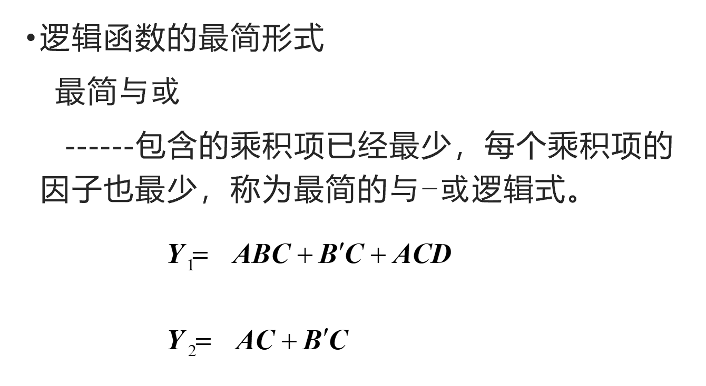
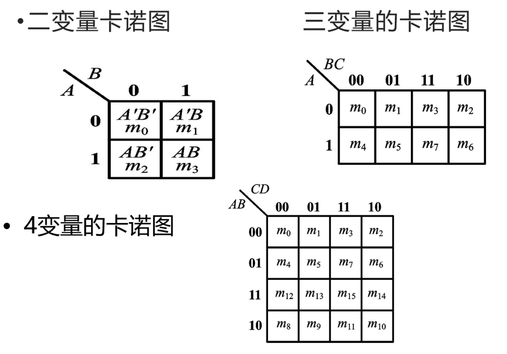
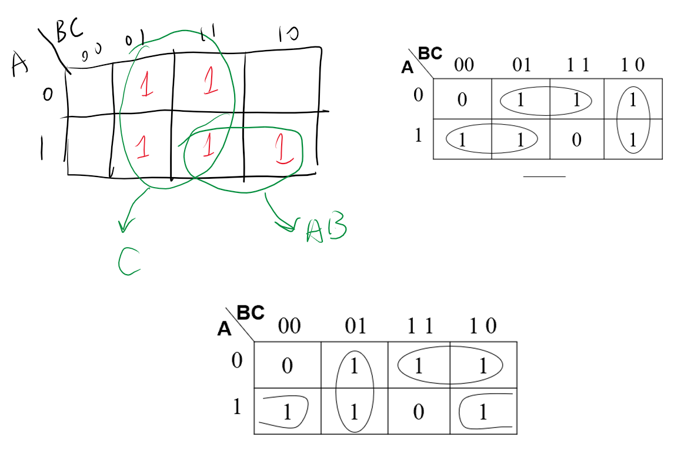

<!--
 * @Author: 小叶同学
 * @Date: 2024-03-13 14:02:10
 * @LastEditors: Please set LastEditors
 * @LastEditTime: 2024-03-13 15:06:09
 * @Description: 请填写简介
-->
# 逻辑函数的化简方法

## 1 公式法

- **重点：**
  - 分配律：$A + BC = (A+B)(A+C)$
  - 摩根定律（反演律）：$(AB)' = A'+B',(A+B)' = A'B'$ 与关系和或关系的互换。
  - 吸收率：$A + A'B = A + B,AB + A'C + BC = AB + A'C$

## 2 卡诺图

**实质：将逻辑函数的最小项之和的以图形的方式表示出来**

==逻辑相邻可化简==$ABC + A'BC = BC$
以2n个小方块分别代表 n 变量的所有最小项，并将它们排列成矩阵，**而且使几何位置相邻**的两个最小项在**逻辑上也是相邻**的（只有一个变量不同），就得到表示n变量全部最小项的卡诺图。   

- 用卡诺图表示逻辑函数步骤
  - 将函数表示为最小项之和的形式  
  - 在卡诺图上与这些最小项对应的位置上添入1，其余地方添0。

- 用卡诺图化简函数
  - 用卡诺图表示逻辑函数
  - 画合并圈(相邻的$2^n$个1，优先画大圈，直到所有1全部圈完)
  - 写出圈的表达式
  - 化简后的乘积项相加（“与或”）

