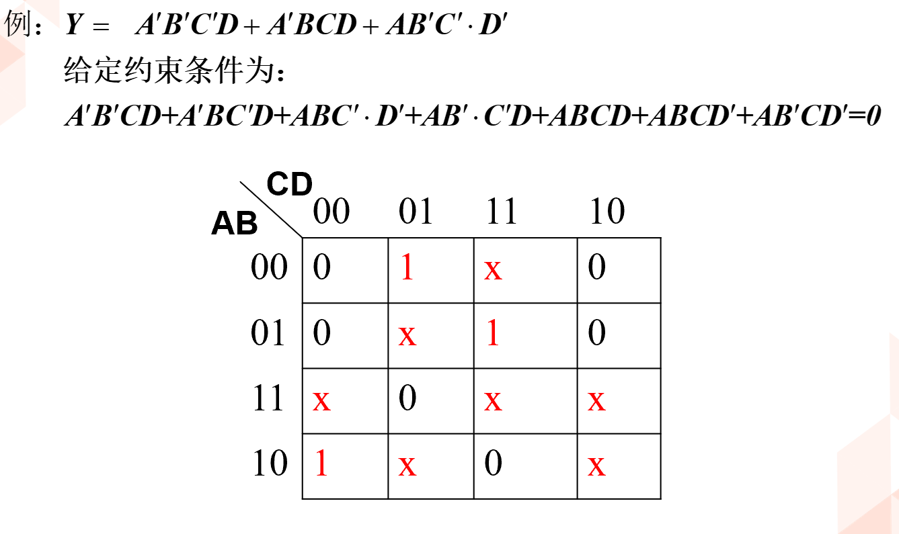
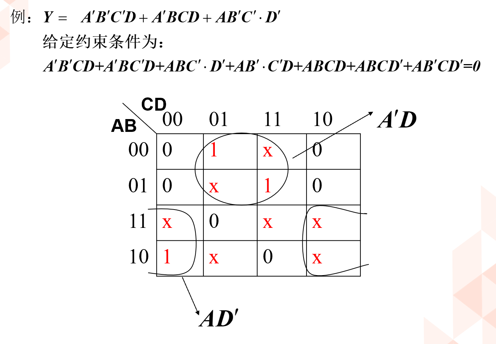
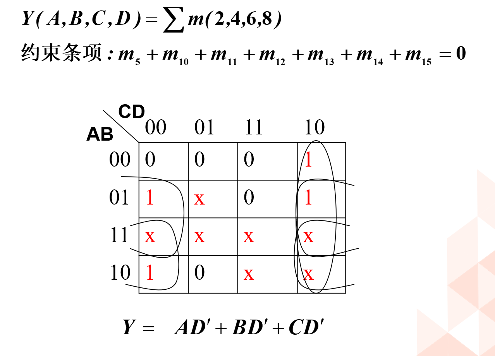
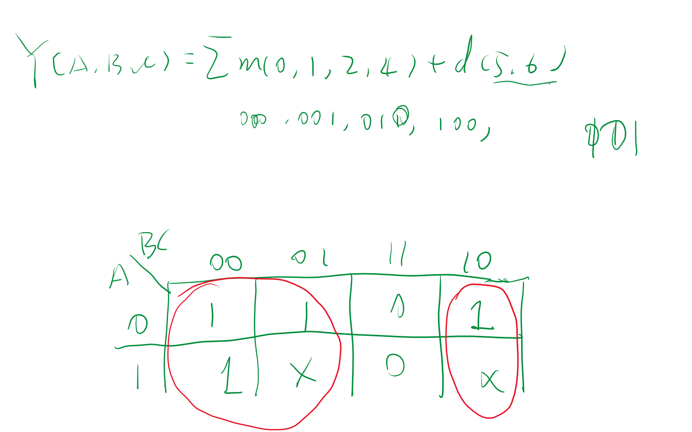

<!--
 * @Author: 小叶同学
 * @Date: 2024-03-13 15:14:55
 * @LastEditors: Please set LastEditors
 * @LastEditTime: 2024-03-13 15:29:29
 * @Description: 请填写简介
-->

# 约束项、任意项和逻辑函数式中的无关项

- 无关项
  - 约束项：在逻辑函数中，对输入变量取值的限制，在这些取值下为1的最小项称为约束项
  - 任意项：在输入变量某些取值下，函数值为1或为0不影响逻辑电路的功能，在这些取值下为1的最小项称为任意项
  

