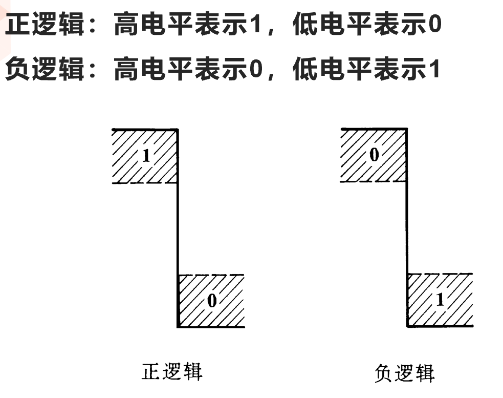
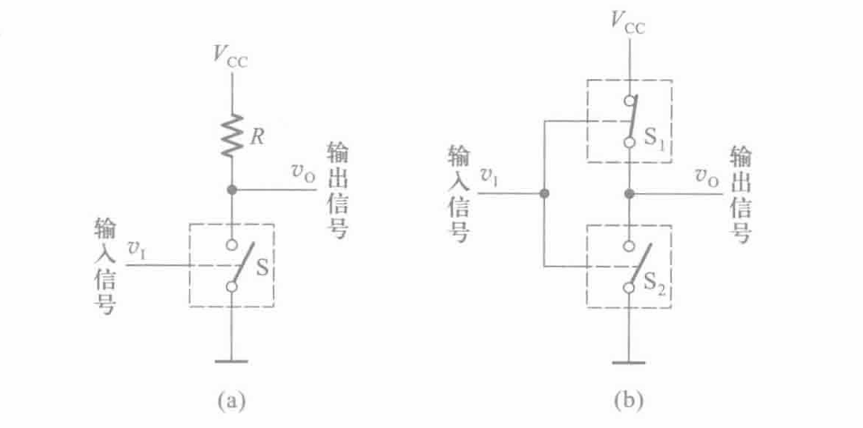
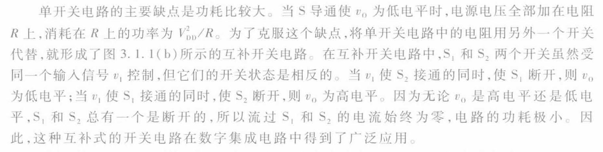

<!--
 * @Author: 小叶同学
 * @Date: 2024-03-14 08:14:35
 * @LastEditors: Please set LastEditors
 * @LastEditTime: 2024-03-14 11:00:57
 * @Description: core 该章节为难点
 * CORE
-->

# 门电路

<!-- @import "[TOC]" {cmd="toc" depthFrom=1 depthTo=6 orderedList=false} -->

<!-- code_chunk_output -->

- [门电路](#门电路)
  - [定义](#定义)
  - [高低电平](#高低电平)
  - [实现方法](#实现方法)

<!-- /code_chunk_output -->

## 定义

定义：
门电路：实现基本运算、复合运算的单元电路，如与门、与非门、或门  ······

## 高低电平

- 低电平：电压小于0.8V，通常表示信号为0；
- 未定义（浮空）：电压介于0.8V和1.2V之间，通常表示信号为1；
- 高电平：电压大于1.2V，通常表示信号为1。

## 实现方法

