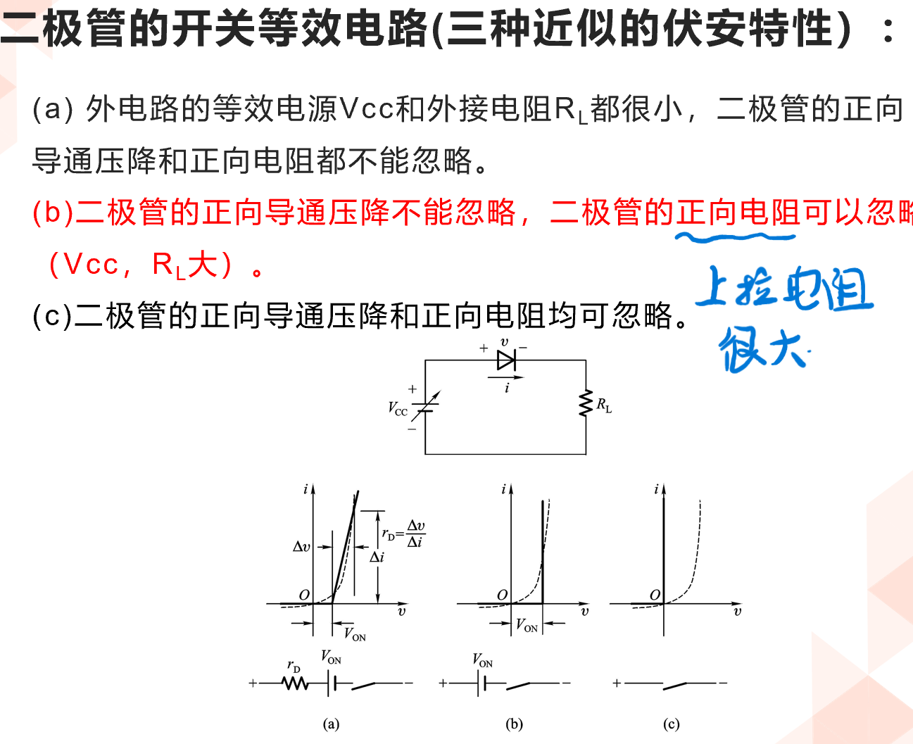
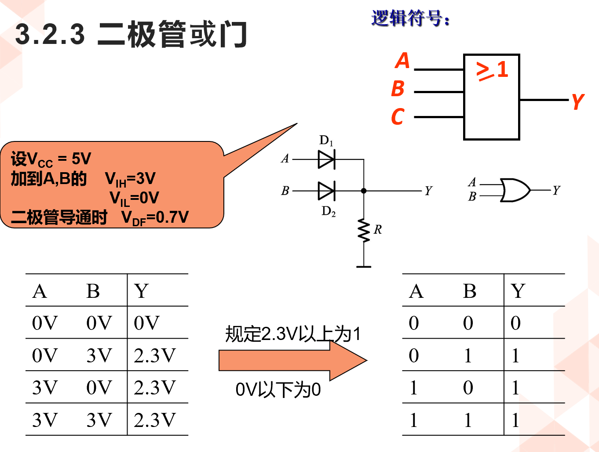

<!--
 * @Author: 小叶同学
 * @Date: 2024-03-14 08:22:18
 * @LastEditors: Please set LastEditors
 * @LastEditTime: 2024-03-14 09:00:44
 * @Description: 请填写简介
-->
# 半导体二极管门电路

<!-- @import "[TOC]" {cmd="toc" depthFrom=1 depthTo=6 orderedList=false} -->

<!-- code_chunk_output -->

- [半导体二极管门电路](#半导体二极管门电路)
  - [1 二极管的开关特性：](#1-二极管的开关特性)
    - [1.1 二极管的等效电路](#11-二极管的等效电路)
    - [1.2 二极管的动态电流波形](#12-二极管的动态电流波形)
  - [2 二极管与门](#2-二极管与门)
  - [3 二极管或门](#3-二极管或门)
  - [4 二极管构成的门电路的缺点](#4-二极管构成的门电路的缺点)

<!-- /code_chunk_output -->

## 1 二极管的开关特性：

单项导通。
将原本的开关置换成了二极管，充当开关。

### 1.1 二极管的等效电路

### 1.2 二极管的动态电流波形

电流之后性，电流发生变换需要时间，载流子的运动需要时间。

## 2 二极管与门

## 3 二极管或门

## 4 二极管构成的门电路的缺点

- 电平平移
- 负载能力差
- 功耗比较高（内阻）：二极管导通有电流消耗。

