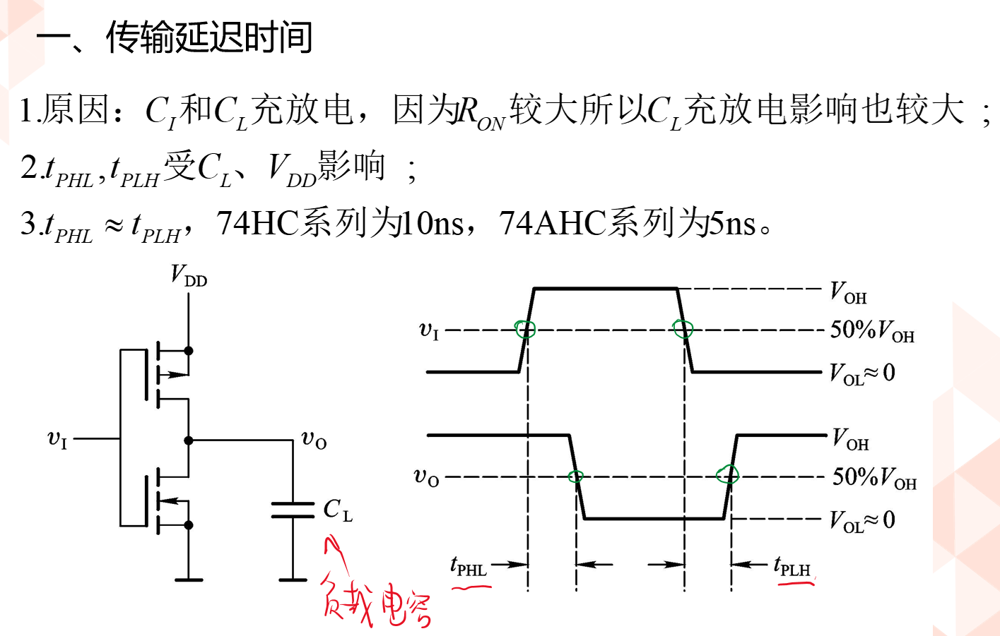
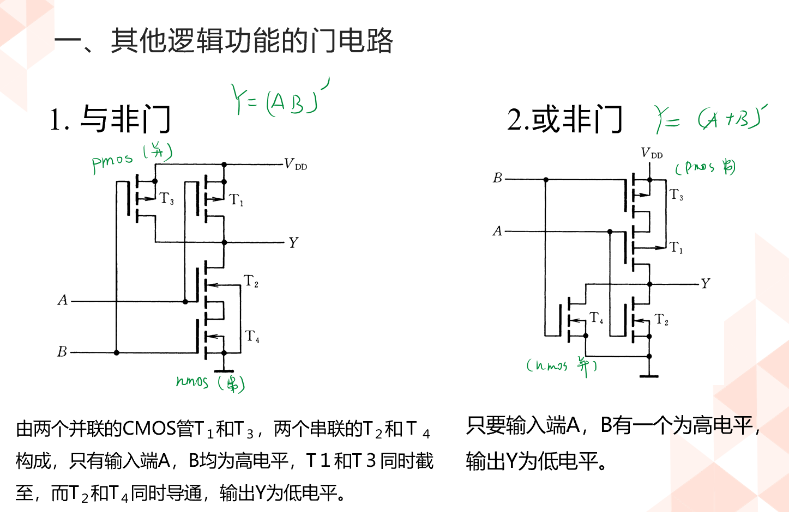

<!--
 * @Author: 小叶同学
 * @Date: 2024-03-14 09:03:32
 * @LastEditors: Please set LastEditors
 * @LastEditTime: 2024-03-21 09:42:59
 * @Description: 请填写简介
-->
# CMOS门电路

<!-- @import "[TOC]" {cmd="toc" depthFrom=1 depthTo=6 orderedList=false} -->

<!-- code_chunk_output -->

- [CMOS门电路](#cmos门电路)
  - [1 MOS管的开关特性](#1-mos管的开关特性)
    - [1.1 MOS管的结构](#11-mos管的结构)
    - [1.2 输入特性和输出特性](#12-输入特性和输出特性)
    - [1.3 MOS管基本开关电路](#13-mos管基本开关电路)
    - [1.4 等效电路](#14-等效电路)
    - [1.5 MOS管的四种类型](#15-mos管的四种类型)
  - [2 CMOS反相器](#2-cmos反相器)
    - [2.1 电路结构](#21-电路结构)
    - [2.2 电压电流传输特性](#22-电压电流传输特性)
    - [2.3 输入噪声容限](#23-输入噪声容限)
  - [3 CMOS反相器的静态输入和输出特性](#3-cmos反相器的静态输入和输出特性)
    - [3.1 输入特性](#31-输入特性)
    - [3.2 输出特性](#32-输出特性)
      - [3.2.1 低电平输出特性](#321-低电平输出特性)
      - [3.2.2 高电平输出特性](#322-高电平输出特性)
  - [4 CMO反相器的动态（转换过程）特性](#4-cmo反相器的动态转换过程特性)
    - [4.1 传输延迟时间](#41-传输延迟时间)
    - [4.2 交流噪声容限](#42-交流噪声容限)
    - [4.3 动态功耗](#43-动态功耗)
  - [5 其他类型的CMOS门电路](#5-其他类型的cmos门电路)
    - [5.1 与非门](#51-与非门)
    - [5.2  或非](#52--或非)
    - [5.3 带缓冲极的CMOS门](#53-带缓冲极的cmos门)
    - [5.4 漏极开路的门电路（OD门）](#54-漏极开路的门电路od门)
      - [5.4.1 $R_L$上拉电阻的计算方法](#541-r_l上拉电阻的计算方法)
    - [5.5 传输门/双向模拟开关](#55-传输门双向模拟开关)
      - [5.5.1 传输门](#551-传输门)
      - [5.5.2 双向模拟开关](#552-双向模拟开关)
      - [5.5.3 三态输出CMOS门电路](#553-三态输出cmos门电路)
        - [5.5.3.1 三态门控制总线](#5531-三态门控制总线)

<!-- /code_chunk_output -->

## 1 MOS管的开关特性

### 1.1 MOS管的结构

### 1.2 输入特性和输出特性

常用共源极的接线方法。

- 转移特性曲线：
    

- 导通电阻
    

### 1.3 MOS管基本开关电路

### 1.4 等效电路

### 1.5 MOS管的四种类型

## 2 CMOS反相器

### 2.1 电路结构

**反相器实现的是“非”的作用**

### 2.2 电压电流传输特性

//功耗极低

### 2.3 输入噪声容限

- 定义：
    输入噪声容限：输入端允许的变化范围。

第一个门电路输出后依然能够作为输出的高电平使用，这样的一个余量（空间），就是噪声容限。

- 噪声容限
    

## 3 CMOS反相器的静态输入和输出特性

### 3.1 输入特性

### 3.2 输出特性

#### 3.2.1 低电平输出特性

#### 3.2.2 高电平输出特性

## 4 CMO反相器的动态（转换过程）特性

### 4.1 传输延迟时间

### 4.2 交流噪声容限

**交流的噪声容限大于静态的噪声容限**

### 4.3 动态功耗

**静态的时候并无电流，是电压型控制，静态功耗忽略不计**

**但是高低电平的跳变过程，电流突变会有很高的功耗**

## 5 其他类型的CMOS门电路

### 5.1 与非门

**更多数量的输入可以增多并联和串联MOS的数量**
但是这种结构并不能一直扩展，因为低电平串联增加在一起可能会变成高点平。

### 5.2  或非

### 5.3 带缓冲极的CMOS门

- **存在的缺点**
  - 输出电阻不恒定
  - 无法多级扩展
  - 工作不同步

- **又出现新问题**
  - 两个与非门是否能直接相连接
  - 

### 5.4 漏极开路的门电路（OD门）

//CORE **所以线与之前必是OD门**

#### 5.4.1 $R_L$上拉电阻的计算方法

### 5.5 传输门/双向模拟开关

#### 5.5.1 传输门

**非逻辑运算门，仅仅用于传输数据**

#### 5.5.2 双向模拟开关

.高阻态 

#### 5.5.3 三态输出CMOS门电路

##### 5.5.3.1 三态门控制总线

