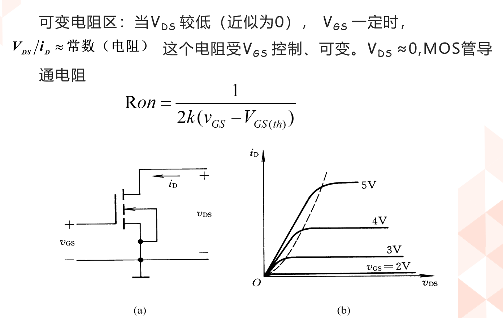
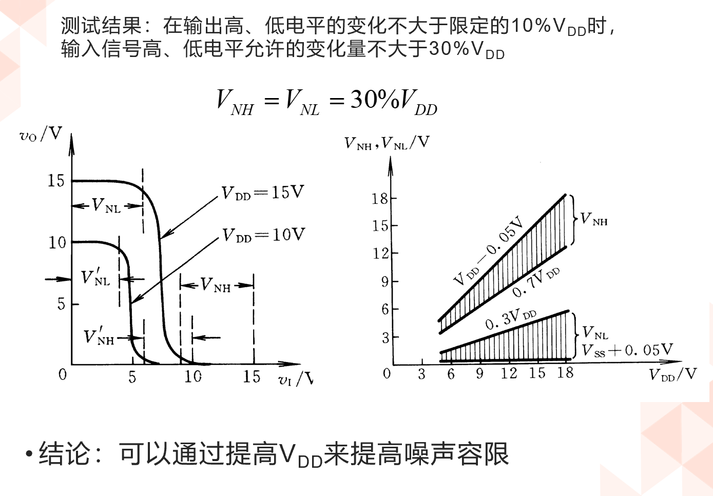

<!--
 * @Author: 小叶同学
 * @Date: 2024-03-14 09:03:32
 * @LastEditors: Please set LastEditors
 * @LastEditTime: 2024-03-20 15:32:59
 * @Description: 请填写简介
-->
# CMOS门电路

<!-- @import "[TOC]" {cmd="toc" depthFrom=1 depthTo=6 orderedList=false} -->

<!-- code_chunk_output -->

- [CMOS门电路](#cmos门电路)
  - [1 MOS管的开关特性](#1-mos管的开关特性)
    - [1.1 MOS管的结构](#11-mos管的结构)
    - [1.2 输入特性和输出特性](#12-输入特性和输出特性)
    - [1.3 MOS管基本开关电路](#13-mos管基本开关电路)
    - [1.4 等效电路](#14-等效电路)
    - [1.5 MOS管的四种类型](#15-mos管的四种类型)
  - [2 CMOS反相器](#2-cmos反相器)
    - [2.1 电路结构](#21-电路结构)
    - [2.2 电压电流传输特性](#22-电压电流传输特性)
    - [2.3 输入噪声容限](#23-输入噪声容限)
  - [3 CMOS反相器的静态输入和输出特性](#3-cmos反相器的静态输入和输出特性)
    - [3.1 输入特性](#31-输入特性)
    - [3.2 输出特性](#32-输出特性)
      - [3.2.1 低电平输出特性](#321-低电平输出特性)
      - [3.2.2 高电平输出特性](#322-高电平输出特性)

<!-- /code_chunk_output -->

## 1 MOS管的开关特性

### 1.1 MOS管的结构

### 1.2 输入特性和输出特性

常用共源极的接线方法。

- 转移特性曲线：
    

- 导通电阻
    

### 1.3 MOS管基本开关电路

### 1.4 等效电路

### 1.5 MOS管的四种类型

## 2 CMOS反相器

### 2.1 电路结构

**反相器实现的是“非”的作用**

### 2.2 电压电流传输特性

//功耗极低

### 2.3 输入噪声容限

- 定义：
    输入噪声容限：输入端允许的变化范围。

第一个门电路输出后依然能够作为输出的高电平使用，这样的一个余量（空间），就是噪声容限。

- 噪声容限
    

## 3 CMOS反相器的静态输入和输出特性

### 3.1 输入特性

### 3.2 输出特性

#### 3.2.1 低电平输出特性

#### 3.2.2 高电平输出特性
