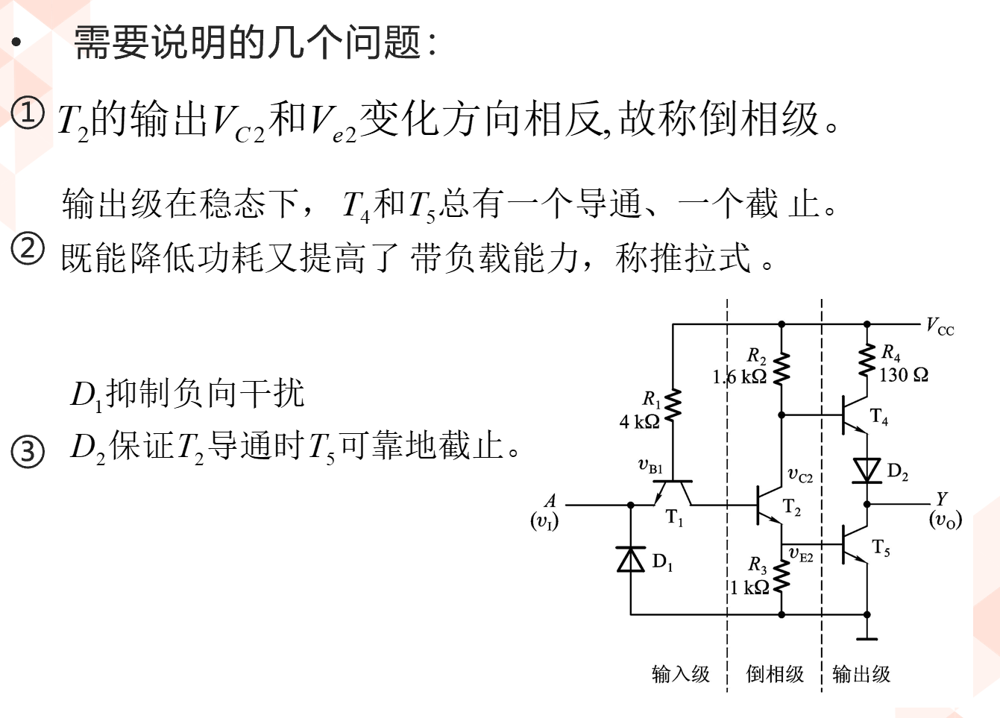
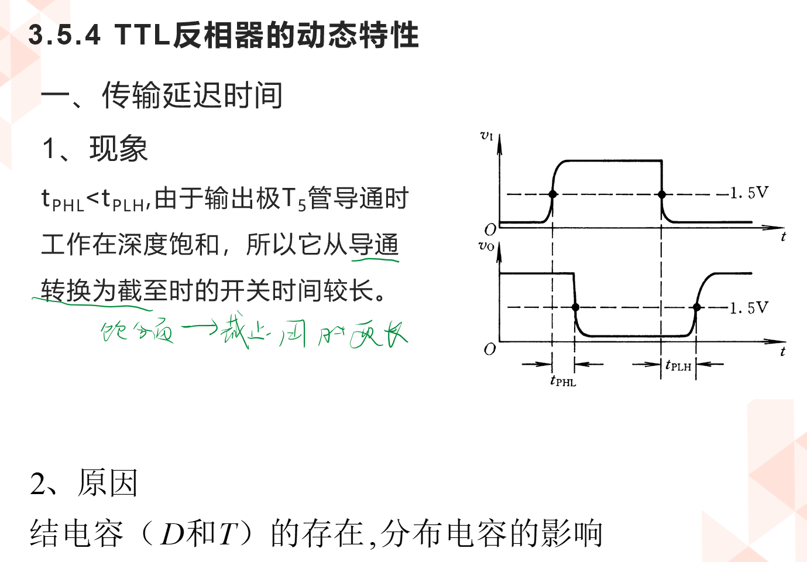

<!--
 * @Author: Ashington ashington258@proton.me
 * @Date: 2024-03-27 14:23:51
 * @LastEditors: Ashington ashington258@proton.me
 * @LastEditTime: 2024-06-12 19:01:02
 * @FilePath: \Digital_Circuits\3.门电路\3.4TTL门电路.md
 * @Description: 请填写简介
 * 联系方式:921488837@qq.com
 * Copyright (c) 2024 by ${git_name_email}, All Rights Reserved. 
-->
# TTL门电路

- [TTL门电路](#ttl门电路)
  - [1 半导体三极管的开关特性](#1-半导体三极管的开关特性)
  - [2 三极管开关电路](#2-三极管开关电路)
  - [3 三极管反相器](#3-三极管反相器)
    - [3.1 TTL反相器](#31-ttl反相器)
      - [3.1.1 TTL反相器的静态输入和输出特性](#311-ttl反相器的静态输入和输出特性)
  - [4 其他类型的TTL电路](#4-其他类型的ttl电路)

## 1 半导体三极管的开关特性

输入输出特性

## 2 三极管开关电路

## 3 三极管反相器

- 质量非常不好
  - 功耗大
  - 温度敏感
  - 功率承载小

### 3.1 TTL反相器

#### 3.1.1 TTL反相器的静态输入和输出特性

- 输入特性

- 输出特性

- 负载特性

- 动态特性

## 4 其他类型的TTL电路

//CORE 计算负载电阻$R_L$

- 三态门

  