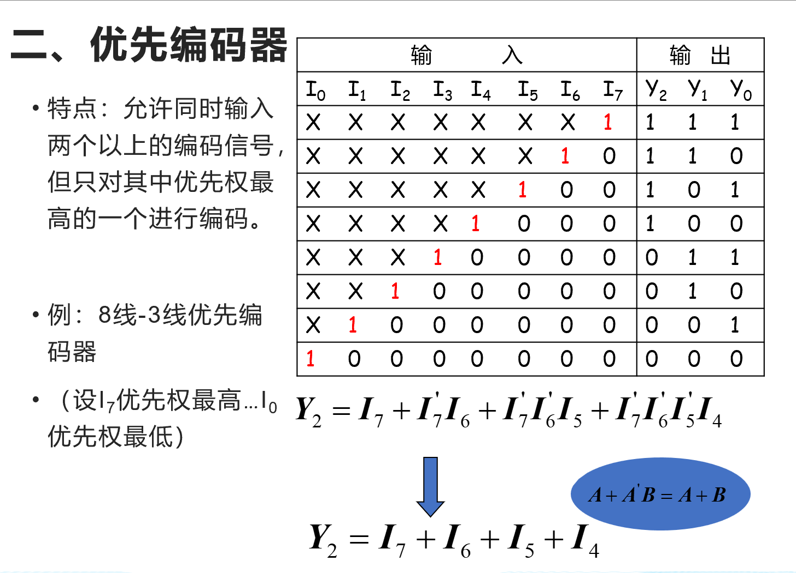
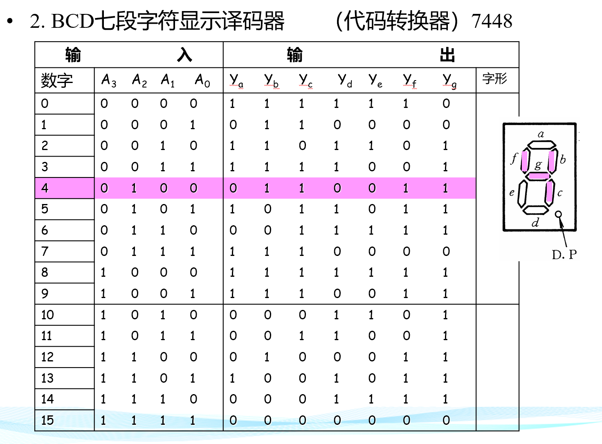
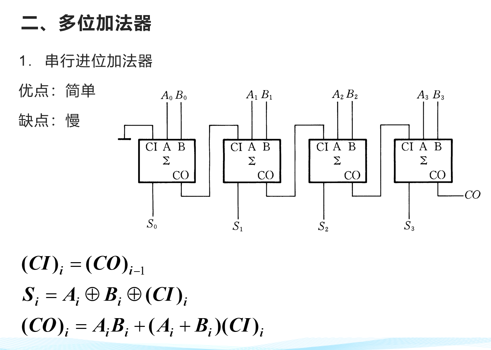
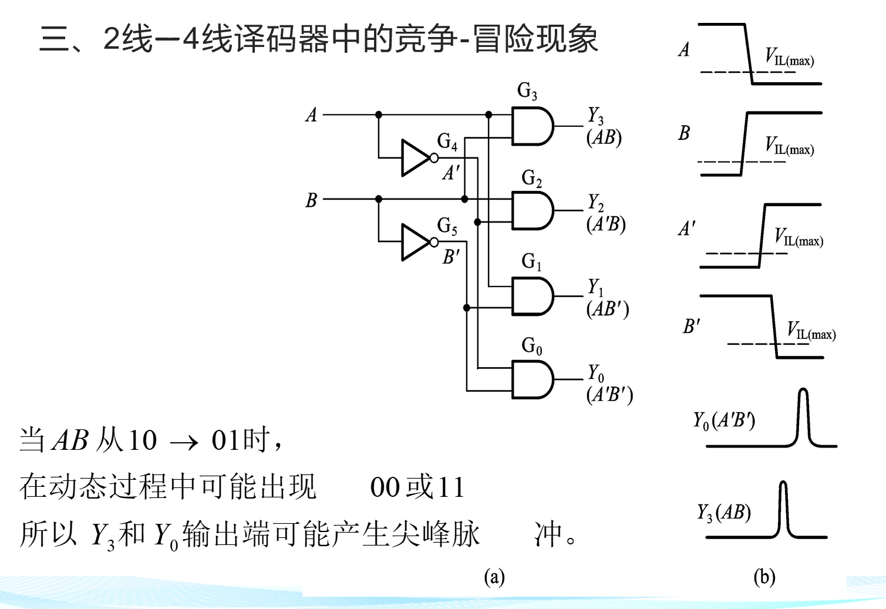

# 常见的组合电路

<!-- @import "[TOC]" {cmd="toc" depthFrom=1 depthTo=6 orderedList=false} -->

<!-- code_chunk_output -->

- [常见的组合电路](#常见的组合电路)
  - [1 编码器](#1-编码器)
    - [1.1 普通编码器](#11-普通编码器)
    - [1.2 优先编码器](#12-优先编码器)
    - [1.3  应用](#13--应用)
  - [2 译码器](#2-译码器)
  - [3 显示译码器](#3-显示译码器)
  - [4 数据选择器](#4-数据选择器)
    - [4.1 数据选择器设计逻辑电路](#41-数据选择器设计逻辑电路)
  - [5 加法器](#5-加法器)
    - [5.1 半加](#51-半加)
    - [5.2 全加](#52-全加)
    - [5.3  多位加法器](#53--多位加法器)
    - [5.4 超前进位加法器](#54-超前进位加法器)
    - [5.5 加法器设计逻辑电路](#55-加法器设计逻辑电路)
  - [6 比较器](#6-比较器)
    - [6.1 单位](#61-单位)
    - [6.2 多位](#62-多位)
  - [6 竞争冒险](#6-竞争冒险)

<!-- /code_chunk_output -->

## 1 编码器

- 编码：将高低点平百年城一个对应的二进制代码
- 普通编码：任何时刻只允许一个输入编码信号
- 优先编码器：允许两个及以上的编码信号，对优先级高的进行编码

### 1.1 普通编码器

### 1.2 优先编码器

### 1.3  应用

1. 位置反馈
2. 速度反馈
3. 角度测量
4. 控制应用
5. 机器视觉
6. 飞行器导航
7. 医学

## 2 译码器

**输出总是最小项，因此这显然很有意义，可以直接用用于实现逻辑函数，逻辑运算。**

//core 使用与非门的形式实现

## 3 显示译码器

## 4 数据选择器

这里的TG是transmit Gate传输们，新号段为下面的费端，属于低电平有效。

### 4.1 数据选择器设计逻辑电路

//CORE 

**当我们考虑如何实现逻辑电路的时候，即考虑如何实现逻辑表达式，即需要弄清楚逻辑函数的变量，真值表等等。**

以上是可行性分析

设计的过程即凑数据端，地址端。

## 5 加法器

### 5.1 半加

### 5.2 全加

### 5.3  多位加法器

串联的缺点就是运行速度以及可靠性。
低位完成运算后等待进位信号才能进行后位运算。

### 5.4 超前进位加法器

### 5.5 加法器设计逻辑电路

## 6 比较器

### 6.1 单位

### 6.2 多位

先比较高位，再比较低位。

## 6 竞争冒险

