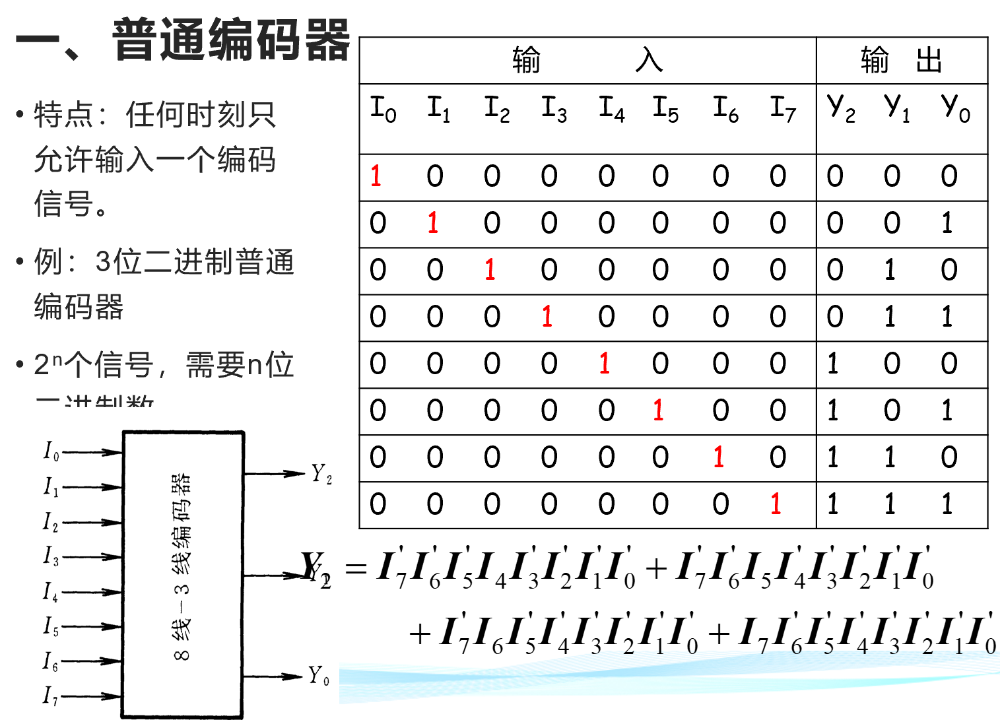
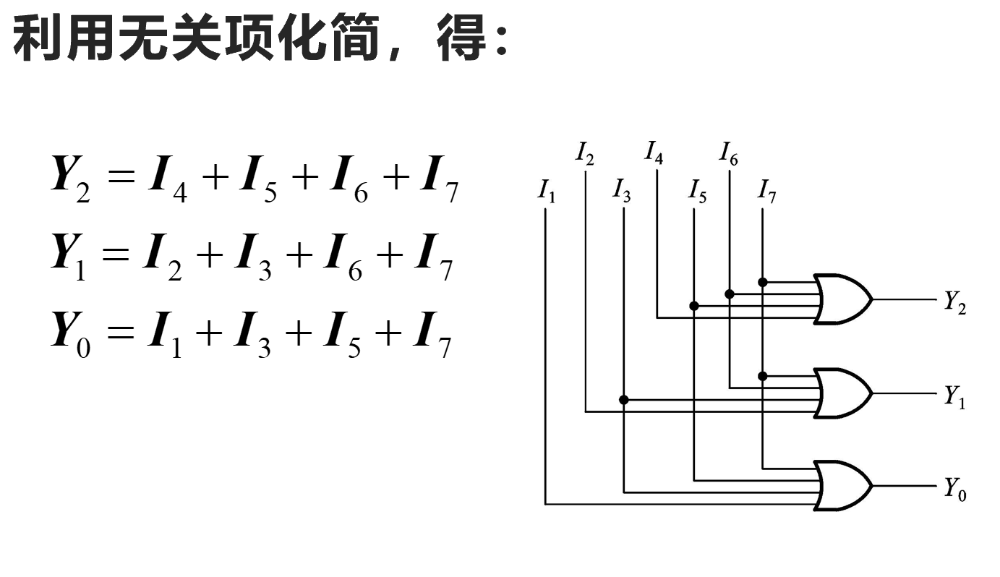
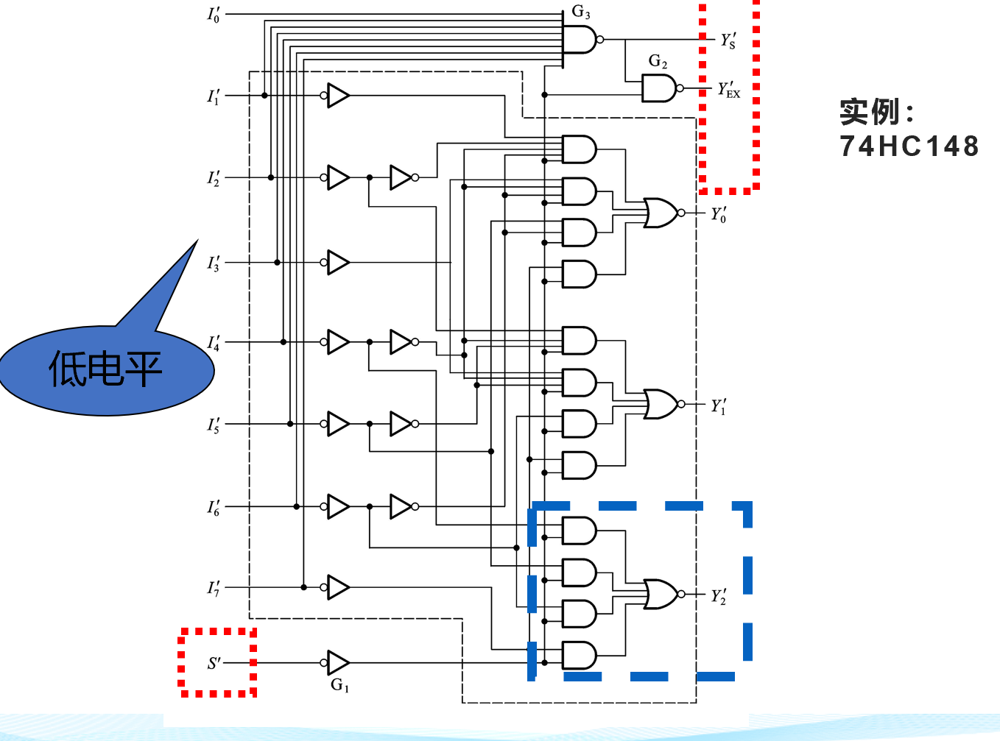
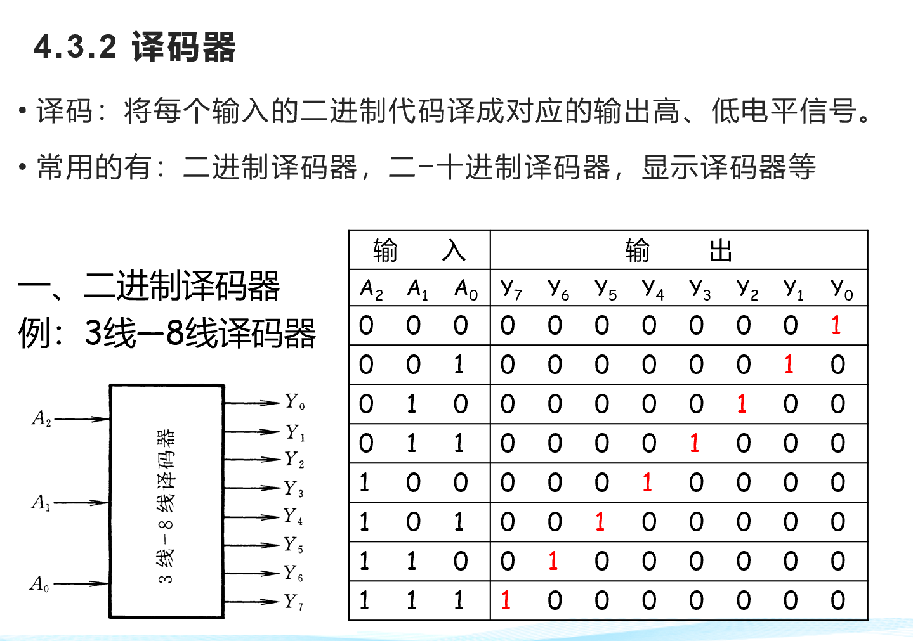
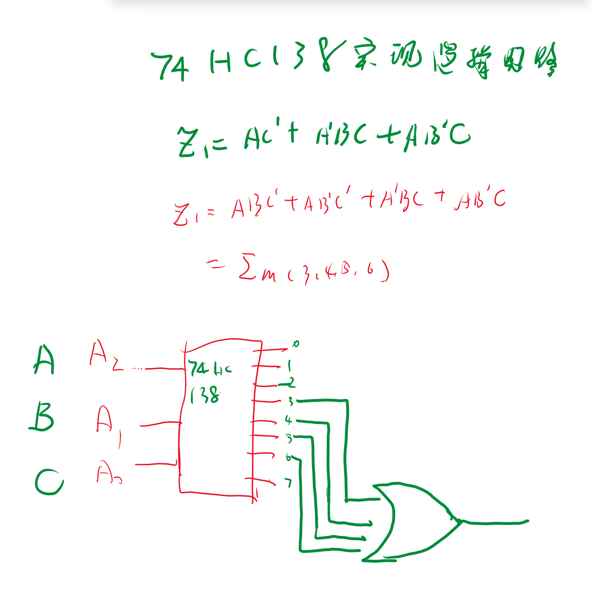
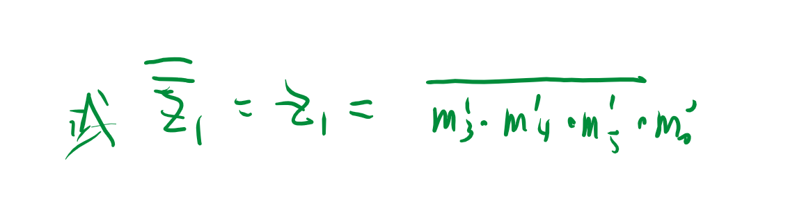

# 常见的组合电路

## 1 编码器

- 编码：将高低点平百年城一个对应的二进制代码
- 普通编码：任何时刻只允许一个输入编码信号
- 优先编码器：允许两个及以上的编码信号，对优先级高的进行编码

### 1.1 普通编码器

### 1.2 优先编码器

### 1.3  应用

1. 位置反馈
2. 速度反馈
3. 角度测量
4. 控制应用
5. 机器视觉
6. 飞行器导航
7. 医学

## 2 译码器

**输出总是最小项，因此这显然很有意义，可以直接用用于实现逻辑函数，逻辑运算。**

//core 使用与非门的形式实现

