# 触发器

<!-- @import "[TOC]" {cmd="toc" depthFrom=1 depthTo=6 orderedList=false} -->

<!-- code_chunk_output -->

- [触发器](#触发器)
  - [1 概述](#1-概述)
  - [2 SR 锁存器](#2-sr-锁存器)
    - [2.1 改进](#21-改进)
      - [2.1.1 电平触发的触发器](#211-电平触发的触发器)
      - [2.1.2 D 触发器](#212-d-触发器)
      - [2.1.3 脉冲触发的触发器](#213-脉冲触发的触发器)
      - [2.1.4 JK 触发器](#214-jk-触发器)
      - [2.1.5 边沿触发器](#215-边沿触发器)
        - [2.1.5.1 D触发器构成的边沿触发](#2151-d触发器构成的边沿触发)
        - [2.1.5.2 CMOS构成的边沿触发器](#2152-cmos构成的边沿触发器)
  - [3 T触发器](#3-t触发器)
  - [4 总结](#4-总结)

<!-- /code_chunk_output -->

---

- 组合逻辑电路，无记忆
- 时序逻辑电路，有记忆

- SR 锁存器
- JK 触发器
- D 触发器

## 1 概述

1. 记忆 1 位二进制信号
   1. 记忆的基本单元
   2. 双稳态：两个稳定状态 0 1 ,也叫双稳态触发器
   3. 可易性：根据输入的信号进行设置为 0， 1
   4. 有互补输出端
   5. 稳态可以转换
2. 触发器的分类
   1. 动作特点
      1. 电平
      2. 脉冲
      3. 边沿
   2. 逻辑功能
      1. SR
      2. JK
      3. D
      4. T
3. 几个说明
   1. 现态：$Q^n$
   2. 次态（新态）：$Q^*或 Q^{n+1 }$
   3. 理解次态，现态以及输入信号之间的逻辑关系，工作特点取决与电路结构，逻辑功能取决与输入端。
   4. 注意
      1. 电路结构 ： 电平 脉冲 边沿
      2. 输入控制端 ： SR ,JK ,D ,T

## 2 SR 锁存器

**想要有记忆性显然需要反馈，我们从模拟电路中获得的灵感**

- 缺点
  - SR 一直影响锁存器的状态，输出收到输入的影响
  - SR 的端如果都为 1 则无效

### 2.1 改进

#### 2.1.1 电平触发的触发器

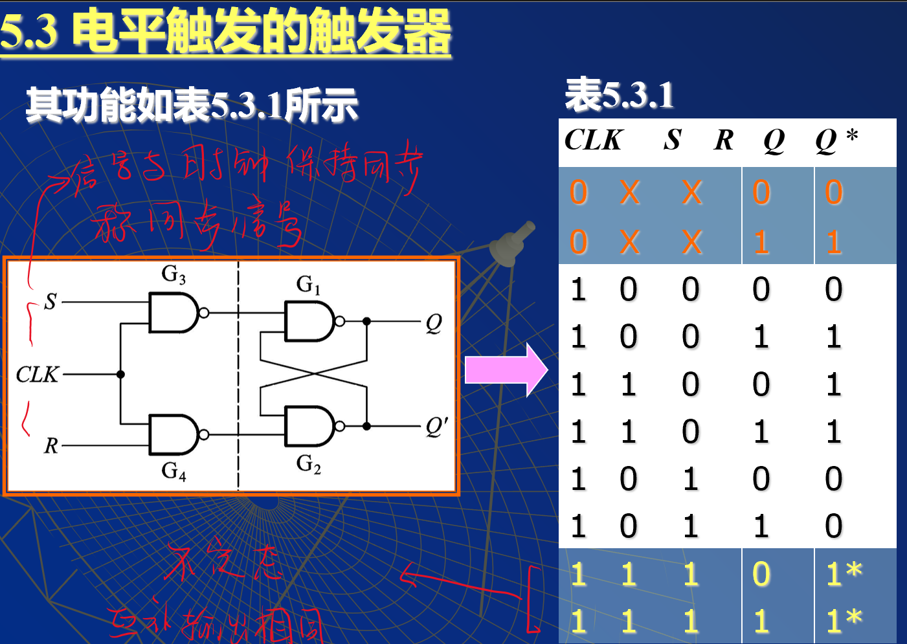
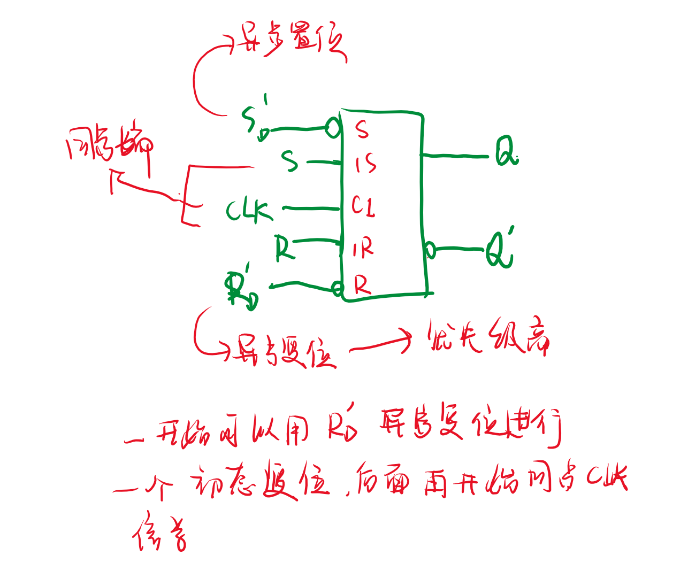

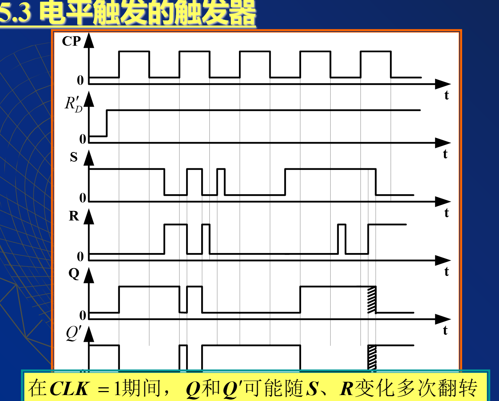

#### 2.1.2 D 触发器

**解决了 SR 不可能同时为 1 的问题**

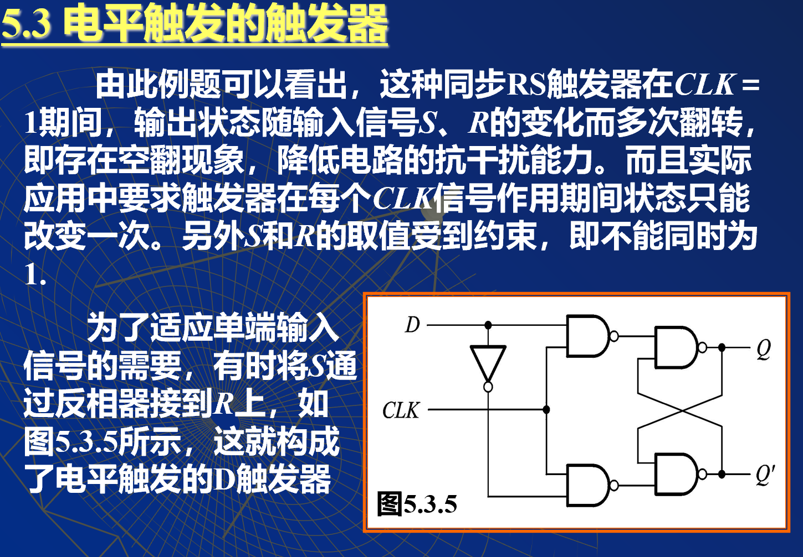

**但这必然诞生了不能同时为 0 的能力，所以他没有了保持功能**

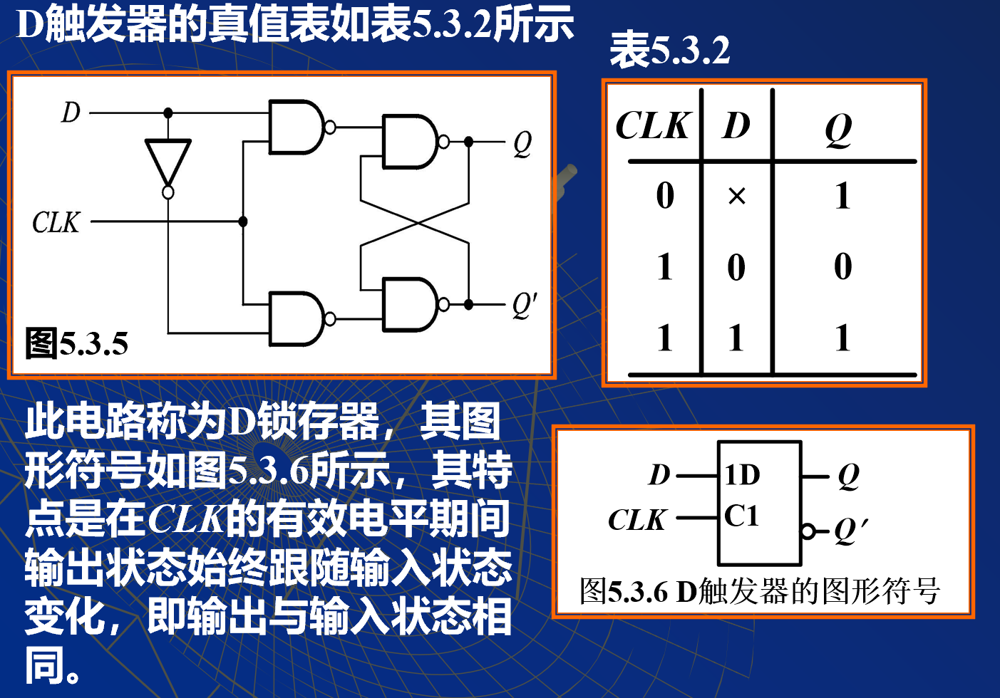

存在"空翻的问题"，无法计数

#### 2.1.3 脉冲触发的触发器

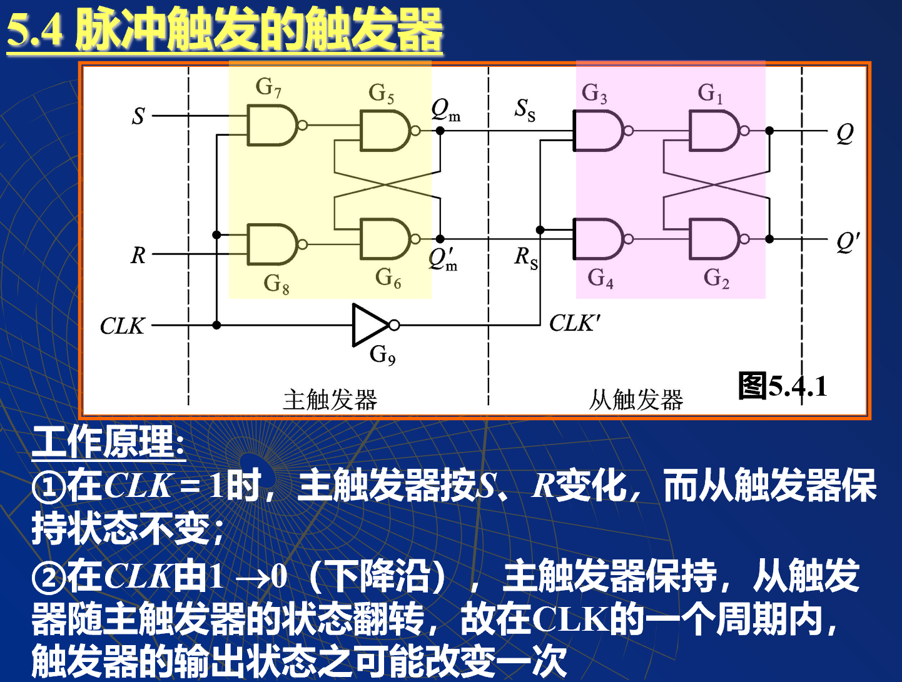

- CLK = 1 主工作，从保持
- CLK = 0 从工作，主保持

**整个触发器的状态，在一个时钟周期里面只能变化一次**

==脉冲的下降沿触发==

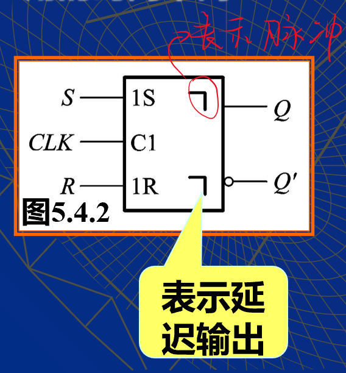

需要看时钟下降沿时，Q 主触发器的状态。

主从 SR 触发器的特性表如表 5.4.1 所示，和电平触发的 SR 触发器相同，只是 CLK 作用的时间不同

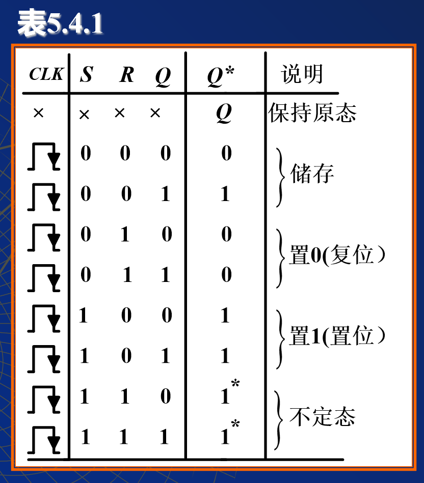

**注意该表未包含主触发器的状态，必须分析主触发器的状态才能使用该表，Q 随主触发器变化，所以 Q 的状态为止**

**当 SR 未发生变化的时候可以查该表**

#### 2.1.4 JK 触发器

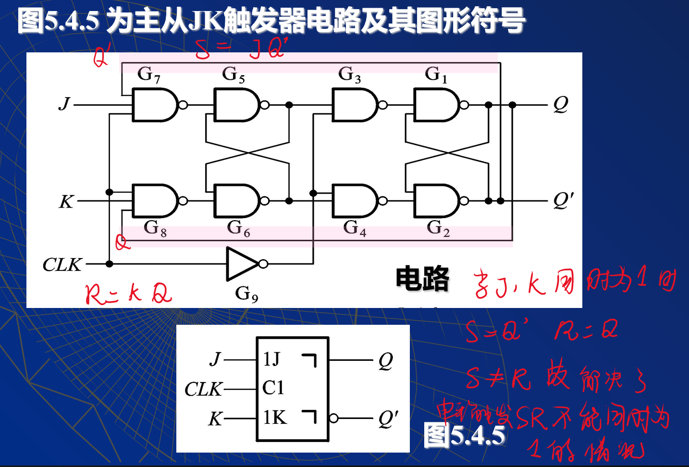

**利用了 Q,Q'互补的输出状态，导致 SR 不可能相同，不能同时为 1**
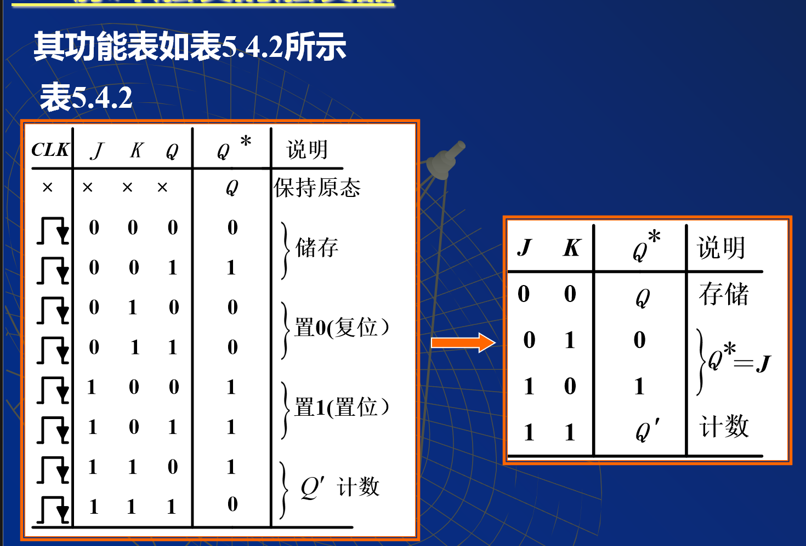

在高电平期间JK的值虽然可以影响主触发器，但是最多==只能翻转一次==。

#### 2.1.5 边沿触发器

JK触发器的判定依赖主触发器，所以分析 比较麻烦，因此我们做出改进。

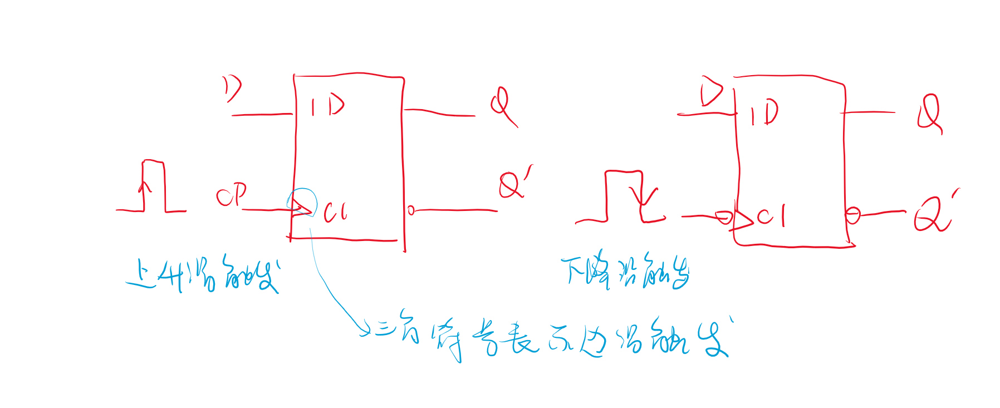

##### 2.1.5.1 D触发器构成的边沿触发

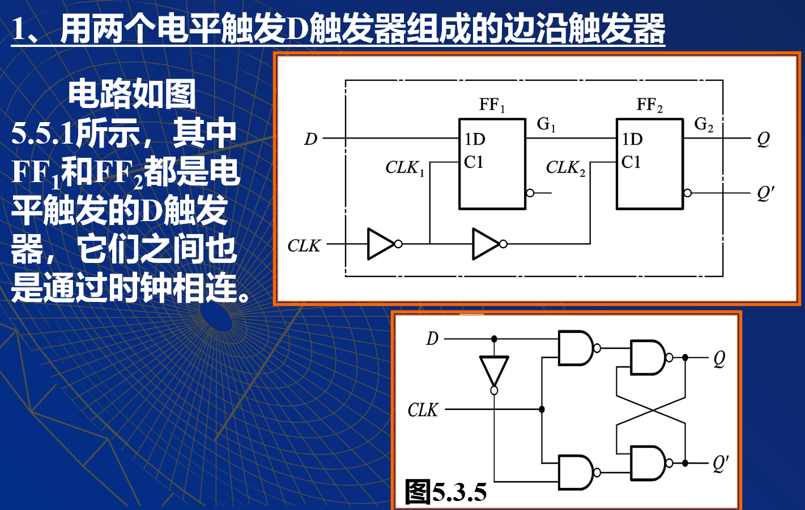

##### 2.1.5.2 CMOS构成的边沿触发器

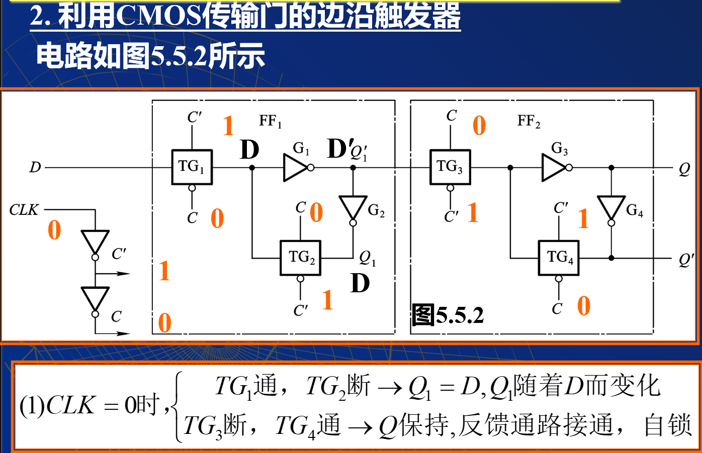
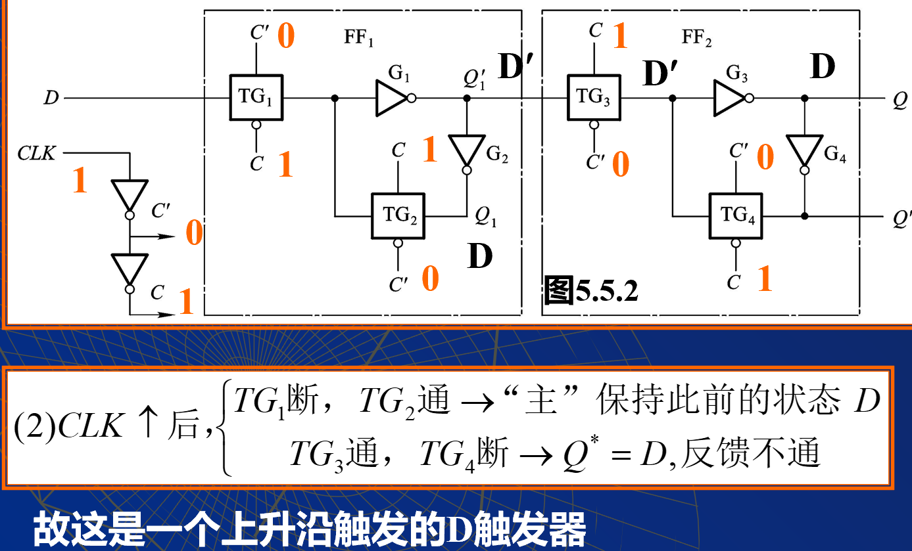
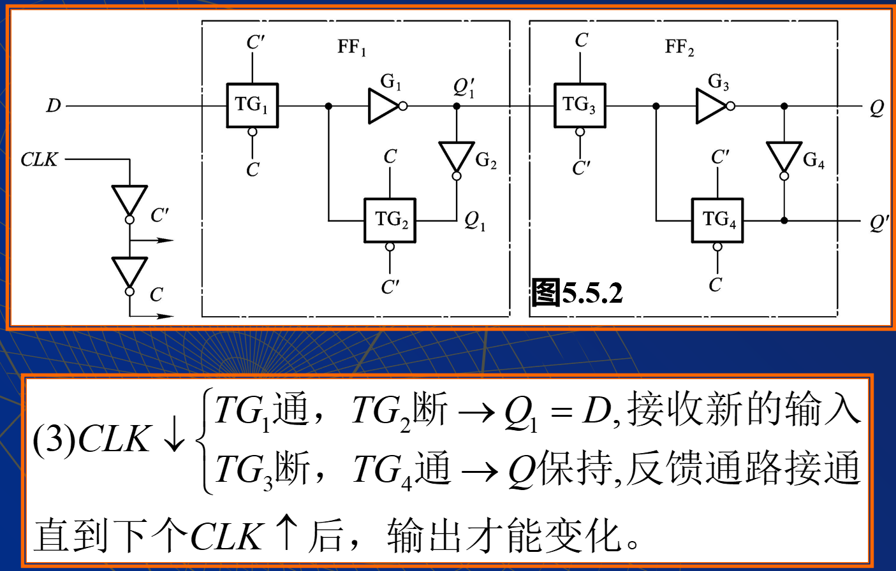

## 3 T触发器

可以分频，可以计数

## 4 总结

//CORE 总结每一个触发器的工作特性，优缺点，以及如何改进。

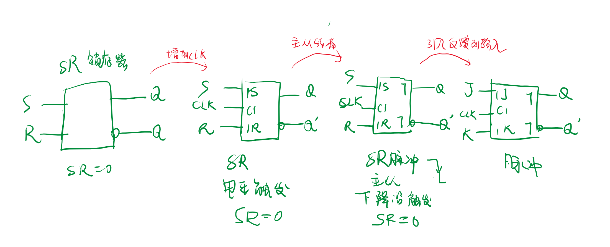
