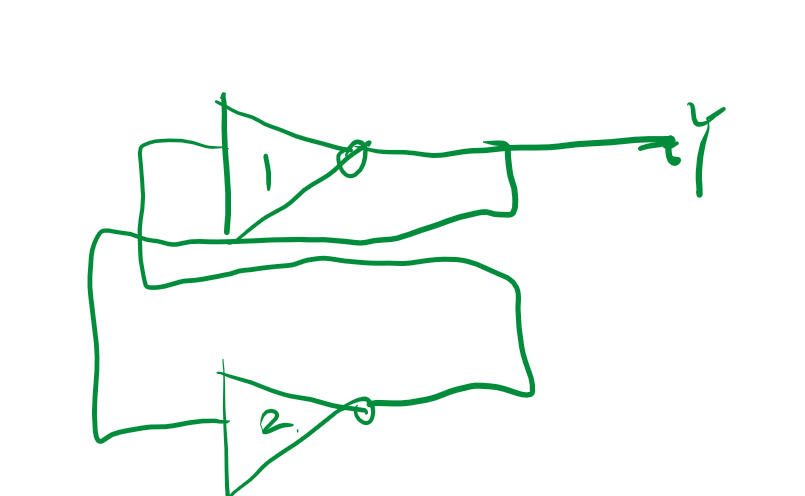
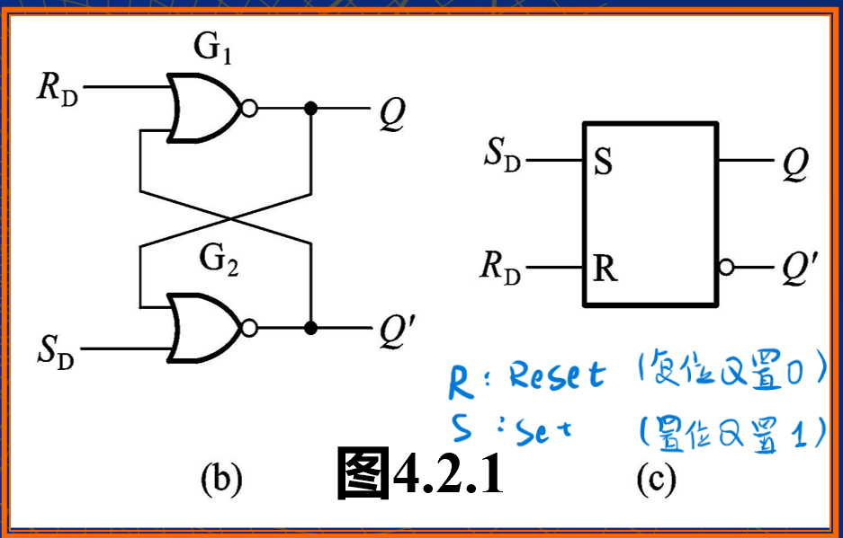
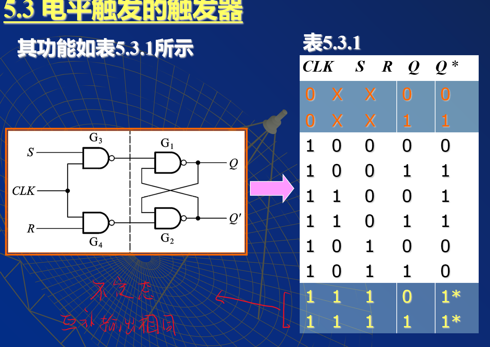

# 触发器

<!-- @import "[TOC]" {cmd="toc" depthFrom=1 depthTo=6 orderedList=false} -->

<!-- code_chunk_output -->

- [触发器](#触发器)
  - [1 概述](#1-概述)
  - [2 SR锁存器](#2-sr锁存器)

<!-- /code_chunk_output -->

---

- 组合逻辑电路，无记忆
- 时序逻辑电路，有记忆

- SR锁存器
- JK触发器
- D触发器

## 1 概述

1. 记忆1位二进制信号
   1. 记忆的基本单元
   2. 双稳态：两个稳定状态0 1 ,也叫双稳态触发器
   3. 可易性：根据输入的信号进行设置为 0， 1
   4. 有互补输出端
   5. 稳态可以转换
2. 触发器的分类
   1. 动作特点
      1. 电平
      2. 脉冲
      3. 边沿
   2. 逻辑功能
      1. SR
      2. JK
      3. D
      4. T
3. 几个说明
   1. 现态：$Q^n$
   2. 次态（新态）：$Q^*或 Q^{n+1 }$
   3. 理解次态，现态以及输入信号之间的逻辑关系，工作特点取决与电路结构，逻辑功能取决与输入端。
   4. 注意
      1. 电路结构 ： 电平 脉冲 边沿
      2. 输入控制端 ： SR ,JK ,D ,T

## 2 SR锁存器

**想要有记忆性显然需要反馈，我们从模拟电路中获得的灵感**

