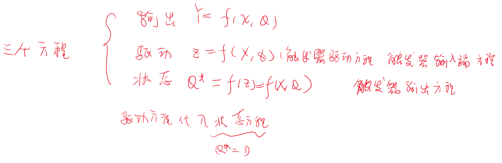

# 时序逻辑电路

## 1 概论

**基本结构**

- 分类
  - 1. 同步异步
  - 2. Mealy 型和 Moore 型
    - 米利型：时序逻辑电路中，输出信号不仅取决于存储电路的状态，而且还取决于输入变量，即$Y = F(X,Q)$
    - 穆尔型：时序逻辑电路中，输出信号仅仅取决于存储电路的状态$Y = F(Q)$

### 1.1 例题

//CORE

画波形图（时序图）

### 1.2 例题

故此电路为有输入控制的逻辑电路，为可控计数器，A＝0为加法计数器，A＝1为减法计数器。

## 2 寄存器

