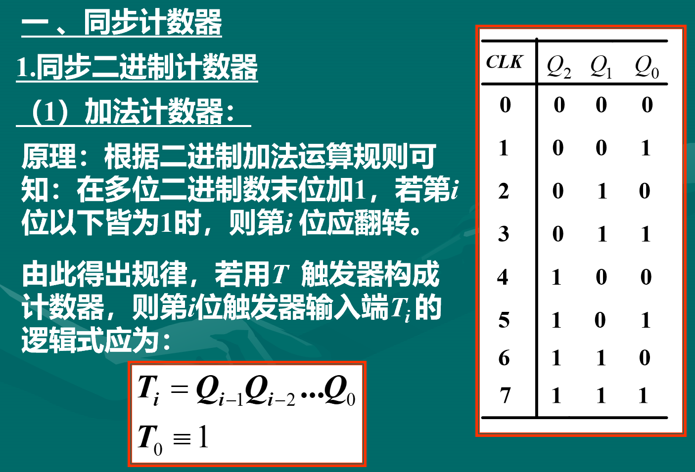
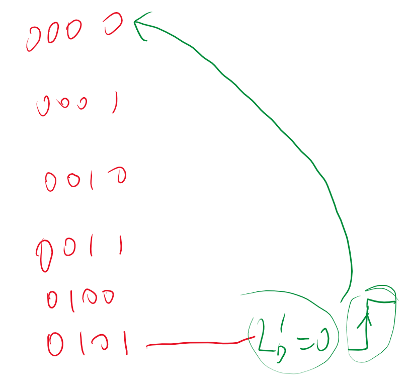

# 时序逻辑电路

- [时序逻辑电路](#时序逻辑电路)
  - [1 概论](#1-概论)
    - [1.1 例题](#11-例题)
    - [1.2 例题](#12-例题)
  - [2 寄存器](#2-寄存器)
    - [2.1 数码寄存器](#21-数码寄存器)
    - [2.2 移位寄存器](#22-移位寄存器)
    - [2.3 计数器](#23-计数器)
      - [2.3.2 异步计数器](#232-异步计数器)
      - [2.3.3 N 进制计数器](#233-n-进制计数器)
      - [2.3.4 计数器进制转化](#234-计数器进制转化)
        - [2.3.4.1 高进制转低进制](#2341-高进制转低进制)
          - [2.3.4.1.2 置零法](#23412-置零法)
          - [2.3.4.1.2 置数法](#23412-置数法)
        - [2.3.4.2 低进制转高进制](#2342-低进制转高进制)
          - [2.3.4.2.1 并行进位](#23421-并行进位)
          - [2.3.4.2.2 串行进位](#23422-串行进位)
          - [2.3.4.2.3 进制无法整分](#23423-进制无法整分)
  - [3 时序逻辑电路的设计](#3-时序逻辑电路的设计)
    - [3.1 设计步骤](#31-设计步骤)

## 1 概论

**基本结构**

- 分类
  - 1. 同步异步
  - 2. Mealy 型和 Moore 型
    - 米利型：时序逻辑电路中，输出信号不仅取决于存储电路的状态，而且还取决于输入变量，即$Y = F(X,Q)$
    - 穆尔型：时序逻辑电路中，输出信号仅仅取决于存储电路的状态$Y = F(Q)$

### 1.1 例题

//CORE

画波形图（时序图）

### 1.2 例题

故此电路为有输入控制的逻辑电路，为可控计数器，A ＝ 0 为加法计数器，A ＝ 1 为减法计数器。

## 2 寄存器

### 2.1 数码寄存器

**并行输入，并行输出**

### 2.2 移位寄存器

**串行输入，并行输出**

### 2.3 计数器

#### 2.3.2 异步计数器

#### 2.3.3 N 进制计数器

#### 2.3.4 计数器进制转化

对状态图直接尽心修改

##### 2.3.4.1 高进制转低进制

**置零法，置数法**

###### 2.3.4.1.2 置零法

###### 2.3.4.1.2 置数法

脉宽很窄的时候可以使用锁存器吧窄脉宽进行拓宽。

同步预置数端信号还得有电平，因此可以保持时钟收起，所以可以只有六个状态

##### 2.3.4.2 低进制转高进制

**并行进位，串行进位**

###### 2.3.4.2.1 并行进位

**时钟型号是同一个**

###### 2.3.4.2.2 串行进位

###### 2.3.4.2.3 进制无法整分

当我们由两个十进制，现在需要29进制怎么办？

**显然我们先拉高，再拉底即可。即先进行低转高，再从高转低**

此时对整体当作一个计数器进行进制转换：

//CORE 译码器设计逻辑电路

## 3 时序逻辑电路的设计

### 3.1 设计步骤

1. 逻辑抽象（状态表，状态转换图（FSM））
   1. 输入变量
   2. 输出变量
   3. 状态转换（FSM）
2. 状态化简
   1. 对状态进行化简，简化程序的设计（什么样的状态可以合并）
      1. 相同的输入
      2. 相同的输出
      3. 回到同一次态
3. 状态分配（编码）
   1. 确定触发器的数目
   2. 给状态进行编码
4. 根据状态转化表写出三组方程
   1. 状态方程
   2. 驱动方程
   3. 输出方程
5. 设计时序逻辑电路